# Tài liệu Thiết kế Kỹ thuật (Design Document)

## Tổng quan (Overview)

Tài liệu này mô tả thiết kế kỹ thuật cho **"Bản Đồ Kỷ Niệm" (Memory Map)** — một ứng dụng di động "anti-social media" cho phép người dùng ghim kỷ niệm đa phương tiện lên bản đồ tương tác. Thiết kế tập trung **chi tiết cho MVP (Phase 1)** và đưa ra **định hướng kiến trúc** cho Phase 2–4 để tránh phải tái cấu trúc lớn về sau.

### Mục tiêu thiết kế

- **Riêng tư là mặc định:** Không quảng cáo, không tracking, phân quyền chặt chẽ theo Owner/Member/Share_Link (Req 1.5, 10.1).
- **Mượt ở quy mô lớn:** Truy vấn không gian theo Bounding_Box bằng PostGIS + chỉ mục GiST, cache Redis cho các bản đồ active (Req 7).
- **Không lưu nhị phân media trên server/DB:** Toàn bộ media đi thẳng client → Cloudflare R2 qua presigned URL; DB chỉ lưu tham chiếu (Req 3.3, 3.4).
- **Offline-first phía client:** Xem text/tọa độ offline, hàng đợi upload với retry nền (Req 9).
- **Toàn vẹn dữ liệu:** Xóa Pin xóa kèm media; xóa tài khoản là thao tác nguyên tử có khả năng thử lại (Req 2.5, 10.2, 10.3).

### Quyết định thiết kế chủ đạo (Key Decisions)

| # | Quyết định | Lý do |
|---|-----------|-------|
| D1 | **Backend: NestJS (Node.js)** theo kiến trúc module | NestJS có module/DI rõ ràng, dễ tách `Auth/Pins/Maps/Media/Sharing`, dễ mở rộng sang WebSocket Gateway ở Phase 2 |
| D2 | **PostgreSQL + PostGIS**, cột `geometry(Point, 4326)` + chỉ mục **GiST** | Truy vấn bounding-box (`ST_MakeEnvelope` + `&&`) hiệu năng cao, chuẩn SRID 4326 (WGS84) |
| D3 | **Prisma ORM** + truy vấn SQL thô cho phần spatial | Prisma cho type-safety và migration; PostGIS thao tác qua `$queryRaw` vì Prisma chưa hỗ trợ geometry native |
| D4 | **Cloudflare R2 + presigned URL** | Media không qua server (tiết kiệm băng thông/đĩa), tuân thủ Req 3.3/3.4; R2 tương thích S3 SDK |
| D5 | **Redis** đệm kết quả bounding-box theo lưới (grid) + active Duo Map | Giảm tải PostGIS cho bản đồ truy cập nhiều; nền tảng cho Pub/Sub real-time Phase 2 |
| D6 | **JWT (access + refresh)** với danh sách thu hồi (denylist) trong Redis | Logout/đổi phiên cần vô hiệu hóa token ngay (Req 1.6) |
| D7 | **Soft-delete có hàng đợi dọn dẹp** cho xóa tài khoản | Đảm bảo tính nguyên tử "xóa xong mới coi là thành công" + thử lại khi R2 lỗi (Req 10.2, 10.3) |
| D8 | **Docker + PM2 cluster trên VPS Linux** | Triển khai đơn giản, tận dụng đa nhân; PM2 quản lý vòng đời tiến trình |
| D9 | **Mobile: Flutter (Dart)** (single codebase iOS/Android) | Render engine Skia/Impeller cho bản đồ nhiều marker + animation "du hành" mượt; một codebase duy nhất cho iOS/Android; hệ sinh thái map/media/offline đầy đủ (`flutter_map`/`mapbox_maps_flutter`, `drift`/`sqflite`, `flutter_image_compress`, `record`, `connectivity_plus`, `workmanager`) |

### Phạm vi (Scope)

- **Trong phạm vi (MVP):** Auth OAuth, Personal Map, Duo Map (đúng 2 người), Media (ảnh/text/audio), Map View (bounding-box), Timeline View, Share Link, offline cache + retry, privacy & account deletion.
- **Ngoài phạm vi (định hướng kiến trúc):** Group Map 3–10 người + real-time, Supercluster, video, AI summary, monetization (Phase 2–4 — xem mục cuối).

---

## Kiến trúc (Architecture)

### Sơ đồ thành phần cấp cao

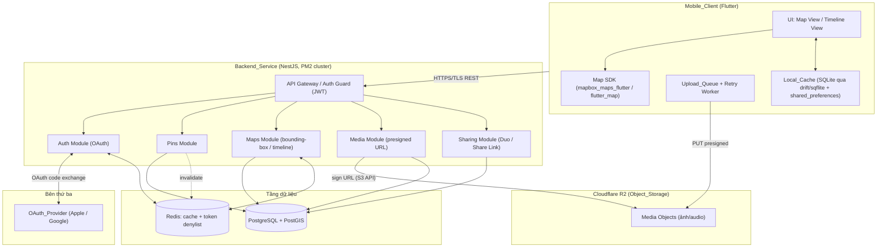

### Luồng dữ liệu media (nguyên tắc cốt lõi)

Media **không bao giờ** đi qua tiến trình backend dưới dạng nhị phân (Req 3.3, 3.4). Backend chỉ:
1. Ký một **presigned PUT URL** cho client để upload trực tiếp lên R2.
2. Lưu **tham chiếu** (`object_key`, `mime`, `size`, loại media) vào PostgreSQL sau khi client xác nhận upload xong.
3. Ký **presigned GET URL** (có thời hạn) khi người dùng có quyền yêu cầu xem media (Req 3.7).

### Phân tầng Backend (NestJS Modules)

| Module | Trách nhiệm | Mapping yêu cầu |
|--------|-------------|-----------------|
| **Auth** | OAuth Apple/Google, cấp/refresh/thu hồi JWT, guard 401 | Req 1 |
| **Pins** | CRUD Pin, validate tọa độ, cascade delete media, kiểm tra quyền | Req 2, 2 (auth) |
| **Maps** | Quản lý Personal/Duo Map, truy vấn bounding-box + timeline, cache | Req 7, 8 |
| **Media** | Sinh presigned URL upload/download, đăng ký tham chiếu, dọn R2 | Req 3 |
| **Sharing** | Duo Map invite/join/revoke, Share Link tạo/thu hồi/truy cập | Req 4, 5, 6 |
| **Account** | Xuất dữ liệu, xóa tài khoản nguyên tử + cleanup | Req 10 |

Mỗi module có cấu trúc `controller` (REST) → `service` (nghiệp vụ, là nơi đặt **logic thuần** để property-test) → `repository` (truy cập PG/Redis/R2). Logic nghiệp vụ thuần (validate tọa độ, kiểm tra bounding-box, quy tắc invitation/member) được tách thành **pure functions** để dễ kiểm thử property-based.

### Hạ tầng triển khai

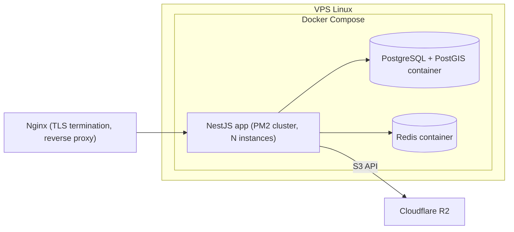

- **Nginx** đảm nhiệm TLS (Req 10.5) và reverse proxy tới cluster PM2.
- **PM2 cluster mode** chạy nhiều instance NestJS tận dụng đa nhân; trạng thái phiên/denylist nằm ở Redis nên các instance không dính trạng thái cục bộ (stateless app tier).

---

## Thành phần và Giao diện (Components and Interfaces)

Tất cả endpoint dưới đây nằm sau Nginx TLS, prefix `/api/v1`. Mọi endpoint (trừ truy cập Share_Link công khai và callback OAuth) yêu cầu `Authorization: Bearer <access_token>`.

### 1. Auth Module (Req 1)

| Method | Path | Mô tả |
|--------|------|-------|
| `POST` | `/auth/oauth/:provider/start` | Khởi tạo luồng OAuth (`provider` ∈ `apple`/`google`), trả về `authorizationUrl` + `state` |
| `POST` | `/auth/oauth/:provider/callback` | Đổi `code` lấy token; tạo/liên kết user; trả `accessToken` + `refreshToken` |
| `POST` | `/auth/refresh` | Đổi `refreshToken` lấy `accessToken` mới |
| `POST` | `/auth/logout` | Vô hiệu hóa access + refresh token hiện tại (đưa `jti` vào Redis denylist) |

**Ví dụ — callback thành công:**
```json
// Response 200
{
  "accessToken": "eyJhbGci...",
  "refreshToken": "eyJhbGci...",
  "expiresIn": 900,
  "user": { "id": "usr_01H...", "displayName": "An", "provider": "google" }
}
```
- Token hết hạn → mọi request bảo vệ trả `401` (Req 1.4).
- OAuth thất bại/hủy → `401` + `{ "error": "oauth_failed" }`, không cấp token (Req 1.3).

### 2. Pins Module (Req 2)

| Method | Path | Mô tả |
|--------|------|-------|
| `POST` | `/maps/:mapId/pins` | Tạo Pin trên một map (personal/duo) mà người gọi có quyền |
| `GET` | `/pins/:pinId` | Xem chi tiết 1 Pin (kèm danh sách media reference) |
| `PATCH` | `/pins/:pinId` | Cập nhật Pin (chỉ người có quyền) |
| `DELETE` | `/pins/:pinId` | Xóa Pin + toàn bộ media liên kết (R2 + DB) |

**Tạo Pin — request:**
```json
// POST /api/v1/maps/map_01H.../pins
{
  "title": "Lần đầu gặp nhau",
  "note": "Quán cà phê nhỏ ở Đà Lạt",
  "memoryDate": "2021-11-20T15:30:00Z",
  "lat": 11.9404,
  "lng": 108.4583
}
```
```json
// Response 201
{
  "id": "pin_01H...",
  "mapId": "map_01H...",
  "title": "Lần đầu gặp nhau",
  "note": "Quán cà phê nhỏ ở Đà Lạt",
  "memoryDate": "2021-11-20T15:30:00Z",
  "lat": 11.9404,
  "lng": 108.4583,
  "createdBy": "usr_01H...",
  "createdAt": "2024-05-01T08:00:00Z",
  "updatedAt": "2024-05-01T08:00:00Z",
  "media": []
}
```
- Tọa độ ngoài `[-90,90]`/`[-180,180]` → `422 unprocessable_entity` + `validation_error` (Req 2.3).
- Sửa/xóa Pin không có quyền → `403 forbidden` (Req 2.6).
- Xem Pin của Personal_Map không sở hữu → trả rỗng/`403` tùy endpoint (Req 2.7, 5.5).

### 3. Maps Module (Req 7, 8)

| Method | Path | Mô tả |
|--------|------|-------|
| `POST` | `/maps` | Tạo Personal_Map (mặc định mỗi user có 1 personal map tạo lúc đăng ký) hoặc Duo_Map |
| `GET` | `/maps/:mapId/pins?bbox=minLng,minLat,maxLng,maxLat` | Truy vấn Pin theo Bounding_Box (Map_View) |
| `GET` | `/maps/:mapId/timeline?order=desc&cursor=...&limit=50` | Truy vấn Pin theo thời gian (Timeline_View) |

**Bounding-box — response:**
```json
// GET /api/v1/maps/map_01H.../pins?bbox=108.40,11.90,108.50,11.98
{
  "bbox": [108.40, 11.90, 108.50, 11.98],
  "count": 2,
  "pins": [
    { "id": "pin_01H...", "lat": 11.9404, "lng": 108.4583, "title": "Lần đầu gặp nhau" },
    { "id": "pin_02H...", "lat": 11.9512, "lng": 108.4421, "title": "Hồ Xuân Hương" }
  ],
  "cached": true
}
```
- Backend chỉ trả Pin **trong** bbox (Req 7.1), dùng PostGIS (Req 7.3), đệm Redis cho map active (Req 7.4).
- Timeline trả Pin sắp theo `memoryDate` (Req 8.1, 8.3); nếu thiếu `memoryDate` → đẩy xuống cuối, vẫn trả danh sách (Req 8.2).

### 4. Media Module (Req 3)

| Method | Path | Mô tả |
|--------|------|-------|
| `POST` | `/pins/:pinId/media/upload-url` | Sinh presigned PUT URL cho R2 (`type` ∈ image/audio/text-blob) |
| `POST` | `/pins/:pinId/media` | Đăng ký tham chiếu media sau khi client upload xong |
| `GET` | `/media/:mediaId/url` | Sinh presigned GET URL (có hạn) để xem media nếu có quyền |
| `DELETE` | `/media/:mediaId` | Xóa media reference + object R2 |

**Xin URL upload — request/response:**
```json
// POST /api/v1/pins/pin_01H.../media/upload-url
{ "type": "image", "mime": "image/jpeg", "sizeBytes": 482000 }
```
```json
// Response 200
{
  "mediaId": "med_01H...",
  "objectKey": "u/usr_01H.../p/pin_01H.../med_01H.jpg",
  "uploadUrl": "https://<account>.r2.cloudflarestorage.com/...&X-Amz-Signature=...",
  "expiresIn": 600,
  "maxSizeBytes": 10485760
}
```
- Vượt giới hạn kích thước (sau nén) → client từ chối trước khi xin URL; backend cũng kiểm `sizeBytes` và trả `413 payload_too_large` (Req 3.5). Trong giới hạn → không cảnh báo (Req 3.6).

### 5. Sharing Module — Duo Map (Req 4, 5)

| Method | Path | Mô tả |
|--------|------|-------|
| `POST` | `/maps/:mapId/invitations` | Owner sinh Invitation duy nhất cho Duo_Map |
| `DELETE` | `/invitations/:invitationId` | Owner thu hồi Invitation chưa dùng |
| `POST` | `/invitations/accept` | Người được mời chấp nhận `{ "code": "INV-..." }` để thành Member thứ 2 |
| `DELETE` | `/maps/:mapId/members/:userId` | Owner gỡ một Member khỏi Duo_Map |

```json
// POST /api/v1/maps/map_duo_01H.../invitations  → 201
{
  "invitationId": "inv_01H...",
  "code": "INV-7QK2-9F1A",
  "shareUrl": "https://memorymap.app/join/INV-7QK2-9F1A",
  "status": "pending",
  "expiresAt": "2024-05-08T08:00:00Z"
}
```
- Đã có Invitation pending chưa hết hạn → `409 conflict` khi xin mới (Req 4.3).
- Map đã đủ 2 member → accept trả `409 map_full` (Req 4.5); Invitation đã accept → `410 gone` (Req 4.6, 5.2).

### 6. Sharing Module — Share Link (Req 6)

| Method | Path | Mô tả |
|--------|------|-------|
| `POST` | `/pins/:pinId/share-links` | Tạo Share_Link cho đúng 1 Pin |
| `DELETE` | `/share-links/:linkId` | Thu hồi Share_Link |
| `GET` | `/public/share/:token` | (Công khai) Truy cập nội dung + tọa độ của Pin được chia sẻ |

```json
// GET /api/v1/public/share/abc123token  → 200
{
  "pin": {
    "title": "Hoàng hôn ở Đà Lạt",
    "note": "...",
    "memoryDate": "2021-11-20T15:30:00Z",
    "lat": 11.9404,
    "lng": 108.4583,
    "media": [ { "type": "image", "url": "https://...r2...signed" } ]
  }
}
```
- Trả đồng thời nội dung + tọa độ (Req 6.2); chỉ 1 Pin, không lộ Pin/map khác (Req 6.3).
- Link bị thu hồi → mọi truy cập sau đó `410 gone` (Req 6.4).

### 7. Account Module (Req 10)

| Method | Path | Mô tả |
|--------|------|-------|
| `GET` | `/account/export` | Xuất dữ liệu Pin + tham chiếu media của chính người dùng |
| `DELETE` | `/account` | Khởi tạo xóa tài khoản nguyên tử (xóa DB + R2 trước khi báo thành công) |

---

## Mô hình dữ liệu (Data Models)

### Sơ đồ quan hệ (ERD)

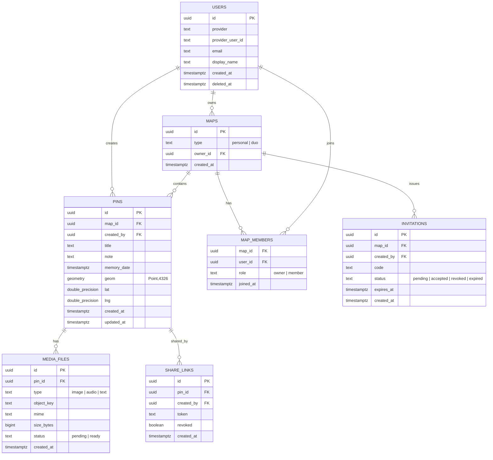

### Schema SQL (PostgreSQL + PostGIS)

```sql
CREATE EXTENSION IF NOT EXISTS postgis;

CREATE TABLE users (
  id                uuid PRIMARY KEY DEFAULT gen_random_uuid(),
  provider          text NOT NULL,                       -- 'apple' | 'google'
  provider_user_id  text NOT NULL,
  email             text,
  display_name      text,
  created_at        timestamptz NOT NULL DEFAULT now(),
  deleted_at        timestamptz,                          -- soft-delete cho xóa nguyên tử
  UNIQUE (provider, provider_user_id)
);

CREATE TABLE maps (
  id         uuid PRIMARY KEY DEFAULT gen_random_uuid(),
  type       text NOT NULL CHECK (type IN ('personal','duo')),
  owner_id   uuid NOT NULL REFERENCES users(id) ON DELETE CASCADE,
  created_at timestamptz NOT NULL DEFAULT now()
);

CREATE TABLE map_members (
  map_id    uuid NOT NULL REFERENCES maps(id) ON DELETE CASCADE,
  user_id   uuid NOT NULL REFERENCES users(id) ON DELETE CASCADE,
  role      text NOT NULL CHECK (role IN ('owner','member')),
  joined_at timestamptz NOT NULL DEFAULT now(),
  PRIMARY KEY (map_id, user_id)
);

CREATE TABLE pins (
  id          uuid PRIMARY KEY DEFAULT gen_random_uuid(),
  map_id      uuid NOT NULL REFERENCES maps(id) ON DELETE CASCADE,
  created_by  uuid NOT NULL REFERENCES users(id),
  title       text,
  note        text,
  memory_date timestamptz,
  lat         double precision NOT NULL CHECK (lat BETWEEN -90 AND 90),
  lng         double precision NOT NULL CHECK (lng BETWEEN -180 AND 180),
  geom        geometry(Point, 4326) NOT NULL,
  created_at  timestamptz NOT NULL DEFAULT now(),
  updated_at  timestamptz NOT NULL DEFAULT now()
);

-- Chỉ mục không gian GiST cho truy vấn bounding-box (Req 7.3)
CREATE INDEX idx_pins_geom ON pins USING GIST (geom);
-- Hỗ trợ timeline (Req 8.1)
CREATE INDEX idx_pins_map_memory ON pins (map_id, memory_date DESC);

CREATE TABLE media_files (
  id         uuid PRIMARY KEY DEFAULT gen_random_uuid(),
  pin_id     uuid NOT NULL REFERENCES pins(id) ON DELETE CASCADE,
  type       text NOT NULL CHECK (type IN ('image','audio','text')),
  object_key text NOT NULL,                 -- khóa đối tượng trên R2 (không lưu nhị phân)
  mime       text,
  size_bytes bigint,
  status     text NOT NULL DEFAULT 'pending' CHECK (status IN ('pending','ready')),
  created_at timestamptz NOT NULL DEFAULT now()
);

CREATE TABLE invitations (
  id         uuid PRIMARY KEY DEFAULT gen_random_uuid(),
  map_id     uuid NOT NULL REFERENCES maps(id) ON DELETE CASCADE,
  created_by uuid NOT NULL REFERENCES users(id),
  code       text NOT NULL UNIQUE,
  status     text NOT NULL DEFAULT 'pending'
             CHECK (status IN ('pending','accepted','revoked','expired')),
  expires_at timestamptz NOT NULL,
  created_at timestamptz NOT NULL DEFAULT now()
);

-- Tối đa 1 invitation 'pending' cho mỗi map (Req 4.3)
CREATE UNIQUE INDEX uniq_pending_invitation
  ON invitations (map_id) WHERE status = 'pending';

CREATE TABLE share_links (
  id         uuid PRIMARY KEY DEFAULT gen_random_uuid(),
  pin_id     uuid NOT NULL REFERENCES pins(id) ON DELETE CASCADE,
  created_by uuid NOT NULL REFERENCES users(id),
  token      text NOT NULL UNIQUE,
  revoked    boolean NOT NULL DEFAULT false,
  created_at timestamptz NOT NULL DEFAULT now()
);
```

### Mô hình Prisma (minh họa)

> Lưu ý: Prisma chưa hỗ trợ kiểu `geometry` native. Cột `geom` được khai báo dạng `Unsupported("geometry(Point, 4326)")` và **truy vấn không gian dùng `$queryRaw`**. Hai cột `lat`/`lng` được giữ song song để đọc/ghi tiện lợi và là nguồn để tạo `geom` qua `ST_SetSRID(ST_MakePoint(lng,lat),4326)`.

```prisma
model Pin {
  id         String     @id @default(uuid())
  mapId      String     @map("map_id")
  createdBy  String     @map("created_by")
  title      String?
  note       String?
  memoryDate DateTime?  @map("memory_date")
  lat        Float
  lng        Float
  geom       Unsupported("geometry(Point, 4326)")
  createdAt  DateTime   @default(now()) @map("created_at")
  updatedAt  DateTime   @updatedAt @map("updated_at")
  map        Map        @relation(fields: [mapId], references: [id], onDelete: Cascade)
  media      MediaFile[]
  shareLinks ShareLink[]
  @@index([mapId, memoryDate(sort: Desc)])
  @@map("pins")
}
```

### Ràng buộc bất biến (Invariants) trong mô hình dữ liệu

- **Tọa độ hợp lệ:** `CHECK (lat BETWEEN -90 AND 90)`, `CHECK (lng BETWEEN -180 AND 180)` (Req 2.3).
- **`geom` luôn đồng bộ với `lat/lng`:** mọi insert/update Pin set `geom = ST_SetSRID(ST_MakePoint(lng, lat), 4326)`.
- **Duo Map ≤ 2 member:** đảm bảo ở tầng service (đếm member trong transaction) + một invitation pending tại một thời điểm (Req 4.3, 4.4).
- **Một invitation pending/map:** `uniq_pending_invitation` partial unique index.
- **Media không nhị phân trong DB:** chỉ có `object_key` trỏ R2 (Req 3.4).

---

## Luồng quan trọng (Key Flows)

### Luồng 1: Đăng nhập OAuth (Req 1.1–1.3)

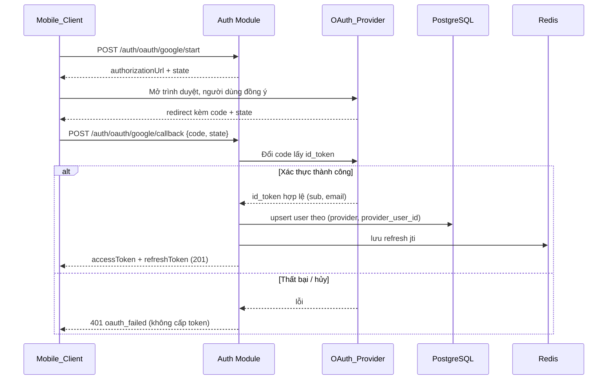

### Luồng 2: Tạo Pin + upload media (Req 2.1, 3.2, 3.3)

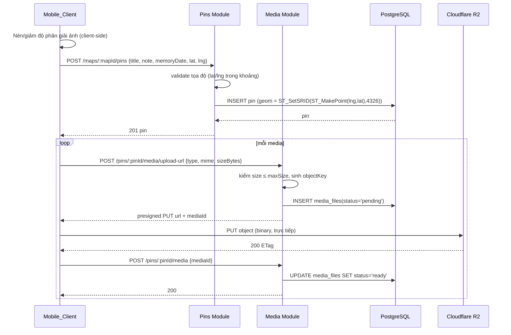

### Luồng 3: Duo Map invite & join (Req 4.2, 4.5, 4.6, 5.1)

```mermaid
sequenceDiagram
    participant O as Owner
    participant G as Guest (người được mời)
    participant SH as Sharing Module
    participant DB as PostgreSQL

    O->>SH: POST /maps/:mapId/invitations
    SH->>DB: kiểm tra không có invitation pending khác (unique partial index)
    alt Đã có pending chưa hết hạn
        SH-->>O: 409 conflict
    else Hợp lệ
        SH->>DB: INSERT invitation(status='pending', expires_at)
        SH-->>O: 201 code + shareUrl
    end
    O->>G: gửi code/link ngoài ứng dụng
    G->>SH: POST /invitations/accept {code}
    SH->>DB: BEGIN; SELECT invitation FOR UPDATE
    alt Hết hạn/đã dùng/bị thu hồi
        SH-->>G: 410 invalid_invitation
    else Map đã đủ 2 member
        SH-->>G: 409 map_full
    else Hợp lệ
        SH->>DB: INSERT map_members(role='member'); UPDATE invitation status='accepted'
        SH->>DB: COMMIT
        SH-->>G: 200 joined
    end
```

### Luồng 4: Bounding-box query với Redis cache + invalidation (Req 7.1, 7.4, 7.5)

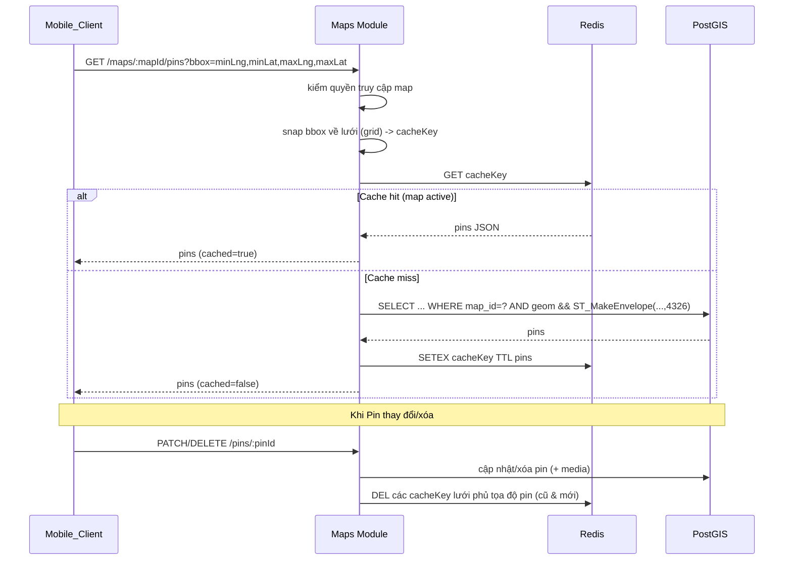

### Luồng 5: Offline create + retry sync (Req 9.2–9.5)

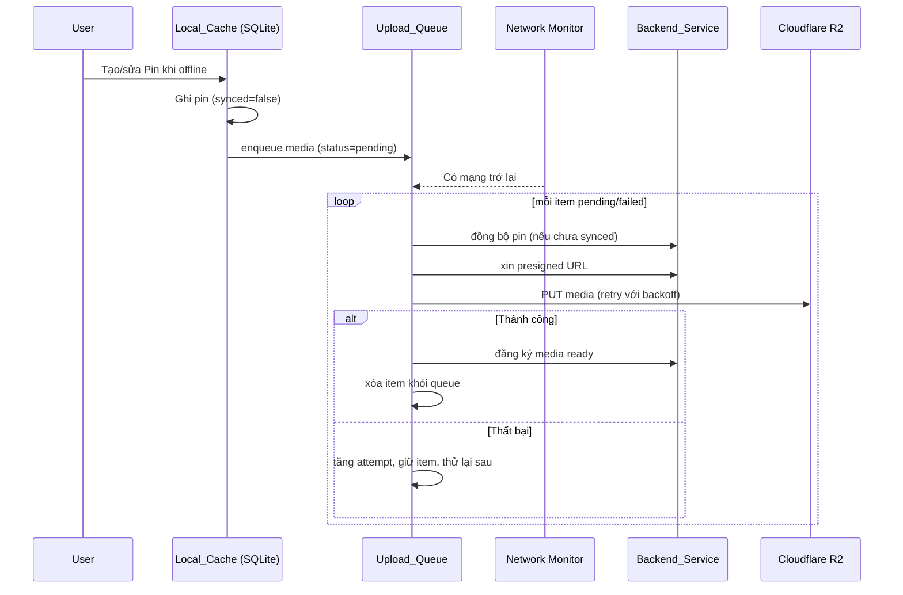

---

## Thiết kế UI/UX (Giao diện & Trải nghiệm người dùng)

> Phần này đặc tả lớp giao diện và trải nghiệm của **Mobile_Client** (Flutter). Nó bổ sung cho các phần backend ở trên (Architecture, Data Models, API, Caching, Offline, Security) và bám sát triết lý sản phẩm "anti-social media": riêng tư, tối giản, kể chuyện qua bản đồ, "du hành qua tọa độ cuộc đời", không quảng cáo, đề cao chiều sâu cảm xúc. Mọi màn hình/đối tượng UI dưới đây đều được ánh xạ về các Requirement tương ứng.

### 1. Nguyên tắc thiết kế trải nghiệm (UX Principles)

| # | Nguyên tắc | Diễn giải | Liên hệ |
|---|-----------|-----------|---------|
| UX1 | **Map-first / Immersive** | Bản đồ là trung tâm và là màn hình gốc. Mọi chrome (thanh điều hướng, nút) ở mức tối thiểu, nổi trên bản đồ dạng bán trong suốt để không che kỷ niệm. Người dùng cảm giác "bước vào" tấm bản đồ cuộc đời. | Req 7 |
| UX2 | **Tối giản (Calm UI)** | Ít yếu tố trên màn hình, nhiều khoảng trắng, một hành động chính rõ ràng mỗi màn hình. Không badge đỏ gây lo âu, không vô số menu. | Triết lý sản phẩm |
| UX3 | **Ưu tiên cảm xúc (Emotion-first)** | Ảnh/âm thanh/ghi chú được trình bày lớn, trang trọng như kỷ vật. Hiệu ứng chuyển cảnh mềm mại, "du hành" mượt giữa các pin thay vì cắt cảnh đột ngột. | Req 2, 3, 8 |
| UX4 | **Riêng tư rõ ràng (Privacy cues)** | Mỗi không gian hiển thị nhãn phạm vi trực quan: 🔒 *Riêng tư* (Personal), 👥 *Cặp đôi* (Duo), 🔗 *Đang chia sẻ* (pin có Share_Link). Người dùng luôn biết "ai thấy được cái này". | Req 1.5, 6.3, 10.1 |
| UX5 | **Giảm áp lực mạng xã hội (No social pressure)** | **Không** có nút like, đếm follower, số lượt xem, bình luận công khai, hay bảng xếp hạng. Không thông báo gây nghiện. Giá trị nằm ở hồi tưởng cá nhân, không ở tương tác xã hội. | Triết lý sản phẩm |
| UX6 | **Mượt khi offline (Offline-graceful)** | Ứng dụng luôn dùng được: xem text/tọa độ ngoại tuyến, tạo pin ngoại tuyến, trạng thái đồng bộ hiển thị minh bạch và không chặn thao tác. | Req 9 |
| UX7 | **Tin cậy & minh bạch dữ liệu** | Người dùng kiểm soát dữ liệu: xuất, xóa pin, xóa tài khoản đều dễ tìm trong Settings; mọi thao tác phá hủy đều có xác nhận. | Req 10 |

### 2. Sơ đồ điều hướng (Navigation Map / Information Architecture)

Cấu trúc điều hướng: **một Root Stack** bao ngoài; sau khi đăng nhập, người dùng vào **Map View làm màn hình gốc (home)**. Thay vì tab bar nặng nề (gây cảm giác "app mạng xã hội"), MVP dùng **mô hình map-first**: Map View toàn màn hình + một **bộ chuyển chế độ Map ↔ Timeline** (segmented control) và một **nút menu/profile** nhẹ ở góc để vào Duo Map switcher và Settings. Các luồng tạo/sửa, chi tiết, mời, chia sẻ mở dạng **modal/bottom sheet** chồng lên bản đồ để giữ ngữ cảnh "du hành".

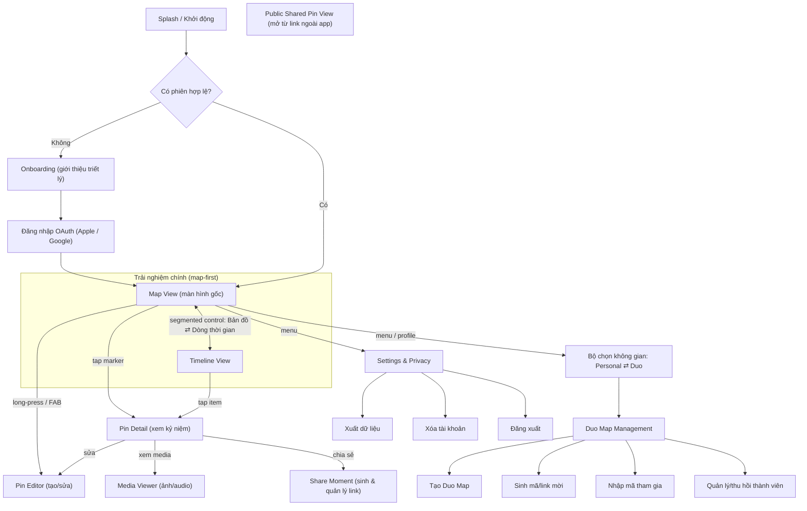

- **Màn hình gốc:** `Map View` (sau khi xác thực). Trước xác thực, gốc là `Splash → Onboarding → Login`.
- **Kiểu navigation:** Root **Navigator/Router** (vd. `Navigator 2.0` hoặc `go_router`); Map ↔ Timeline là **chuyển chế độ tại chỗ** (segmented control, cùng dữ liệu một map) chứ không phải tab tách biệt; các luồng phụ (Detail, Editor, Duo, Share, Settings) là **route push** hoặc **modal/bottom sheet** (`showModalBottomSheet`).
- **Public Shared Pin View** là một entry point **độc lập** (deep link `memorymap.app/p/:token`) không yêu cầu đăng nhập, không dẫn vào phần còn lại của app (Req 6.3).

### 3. Danh mục màn hình (Screen Inventory)

| Màn hình | Mục đích | Thành phần UI chính | Trạng thái (loading/empty/error/offline) | Req |
|----------|----------|---------------------|------------------------------------------|-----|
| **Splash** | Khởi động, kiểm tra phiên | Logo, kiểm tra token im lặng | loading: spinner ngắn; error: chuyển về Login | 1.4 |
| **Onboarding** | Truyền tải triết lý "anti-social media", xin quyền vị trí/ghi âm | 2–3 slide tối giản, nút "Bắt đầu" | empty: bỏ qua nếu đã xem | — |
| **Đăng nhập OAuth** | Xác thực bằng Apple/Google | Nút "Tiếp tục với Apple", "Tiếp tục với Google" | loading: khi mở web OAuth; error: banner "Đăng nhập thất bại" (Req 1.3) | 1.1–1.3 |
| **Map View** (gốc) | Xem & du hành các pin theo khung nhìn | Bản đồ toàn màn hình, marker, FAB thả ghim, segmented Map/Timeline, nhãn phạm vi, offline banner | loading: skeleton marker; empty: gợi ý "Thả ghim đầu tiên"; error: nút thử lại; offline: dùng Local_Cache + banner | 7.1, 7.2, 9.1 |
| **Pin Detail** | Xem chi tiết một kỷ niệm | Tiêu đề, ghi chú, ngày kỷ niệm, gallery media, nút Phát audio, nút Sửa/Xóa/Chia sẻ, badge phạm vi | loading: placeholder media; error: "Không tải được kỷ niệm"; offline: text/tọa độ hiện đủ, media placeholder | 2.4, 3.7, 8.4, 9.1 |
| **Pin Editor** | Tạo/sửa pin: nhập title/note/memoryDate, đính ảnh/text/audio, ghi âm, xác nhận tọa độ | Form (title, note, date picker), bộ chọn tọa độ trên mini-map, nút đính kèm ảnh/ghi âm, ô ghi chú, recorder control, thanh tiến trình upload | loading: khi lưu; error: lỗi validate tọa độ (Req 2.3) / quá kích thước (Req 3.5); offline: lưu cục bộ + badge "chờ đồng bộ" | 2.1–2.3, 3.1–3.6, 9.2 |
| **Media Viewer** | Xem ảnh phóng to / nghe audio | Ảnh full-screen (pinch-zoom), trình phát audio (play/seek), caption | loading: spinner; error: "Media chưa tải"; offline: placeholder nếu chưa cache | 3.7, 9.1 |
| **Timeline View** | Danh sách kỷ niệm theo thời gian | List item (thumbnail + title + ngày), bộ chọn thứ tự (mới→cũ / cũ→mới), nhãn "Chưa rõ ngày" | loading: skeleton list; empty: "Chưa có kỷ niệm"; error: thử lại; offline: từ cache | 8.1–8.4 |
| **Duo Map Management** | Tạo Duo Map, sinh mã/link mời, nhập mã tham gia, quản lý/thu hồi thành viên | Nút "Tạo bản đồ Cặp đôi", thẻ Invitation (mã + link + hạn), ô nhập mã, danh sách thành viên + nút Gỡ/Thu hồi | loading; empty: "Chưa có bản đồ chung"; error: 409 đã có invite pending (Req 4.3) / map_full (Req 4.5) / 410 invite không hợp lệ (Req 5.2) | 4.1–4.7, 5.1, 5.6 |
| **Share Moment** | Sinh & quản lý Share_Link cho 1 pin | Toggle "Tạo liên kết chia sẻ", ô hiển thị link + nút sao chép/chia sẻ hệ thống, nút "Thu hồi" | loading khi sinh/thu hồi; error: thử lại; trạng thái: Đang chia sẻ / Đã thu hồi | 6.1, 6.3, 6.4 |
| **Public Shared Pin View** | Người ngoài xem 1 pin qua link (không cần đăng nhập) | Ảnh/ghi chú/ngày, mini-map chỉ 1 marker, nhãn "Được chia sẻ qua Bản Đồ Kỷ Niệm", CTA tải app | loading; error/`410`: "Liên kết đã bị thu hồi hoặc không tồn tại" (Req 6.4) | 6.2, 6.3, 6.4 |
| **Settings & Privacy** | Quản trị dữ liệu & phiên | Mục Xuất dữ liệu, Xóa tài khoản (xác nhận 2 bước), Đăng xuất, ngôn ngữ, thông tin "Không quảng cáo/không tracking" | loading khi export/xóa; xóa tài khoản hiển thị tiến trình "đang xóa" (Req 10.3); error: cho thử lại | 1.5, 1.6, 10.2, 10.3, 10.6 |

### 4. Wireframe mô tả (ASCII layout) — các màn hình trọng yếu

#### 4.1 Map View (màn hình gốc)

```
┌─────────────────────────────────────┐
│ 🔒 Bản đồ của tôi        [☰ menu]   │  ← thanh nổi bán trong suốt: nhãn phạm vi + menu/profile
│ ┌───────────────────────────────┐   │
│ │  ⚠ Đang ngoại tuyến – xem từ   │   │  ← offline banner (chỉ hiện khi mất mạng, Req 9.1)
│ │     bộ nhớ đệm                 │   │
│ └───────────────────────────────┘   │
│                                       │
│            ●(selected)                │  ← marker trong viewport (Req 7.2)
│        ●            ●                  │
│                 ●        ●            │
│                                       │
│     ●        ●                        │
│                                       │
│  ┌─────────────────────────────┐     │
│  │  [ Bản đồ ]  |  Dòng thời gian│     │  ← segmented control Map ⇄ Timeline (UX1)
│  └─────────────────────────────┘     │
│                              ( + )    │  ← FAB thả ghim (Req 2.1)
└─────────────────────────────────────┘
Cử chỉ: tap marker → Pin Detail · long-press bản đồ → Pin Editor tại tọa độ đó ·
        pan/zoom → cập nhật Bounding_Box query (Req 7.1) · pinch → zoom
```

#### 4.2 Pin Editor (tạo/sửa)

```
┌─────────────────────────────────────┐
│ ✕  Kỷ niệm mới            [ Lưu ]    │
│                                       │
│  Tiêu đề                              │
│  [ Lần đầu gặp nhau________________ ] │  ← title (Req 2.2)
│                                       │
│  Ghi chú                              │
│  [ Quán cà phê nhỏ ở Đà Lạt...      ]│  ← note đa dòng (Req 2.2)
│  [                                  ] │
│                                       │
│  Thời điểm kỷ niệm   [ 20/11/2021 📅]│  ← memoryDate picker (Req 2.2)
│                                       │
│  Vị trí  📍 11.9404, 108.4583         │
│  ┌───────────────┐  [ Chỉnh trên bản │  ← mini-map xác nhận/kéo tọa độ
│  │   mini-map  ● │   đồ ]            │     (báo lỗi nếu ngoài [-90,90]/[-180,180], Req 2.3)
│  └───────────────┘                    │
│                                       │
│  Đính kèm:  [📷 Ảnh] [✏ Văn bản] [🎙 Ghi âm]  ← 3 loại media (Req 3.1)
│  ┌────┐ ┌────┐                        │
│  │img │ │ ▶  │  ◖▓▓▓▓░░ 70%◗          │  ← thumbnail + upload progress (Req 3.2, 9.2)
│  └────┘ └────┘                        │
│  🎙 ●REC 00:12  ▮▮▮▯▯  [ Dừng ]       │  ← recorder control
└─────────────────────────────────────┘
Trạng thái: offline → "Sẽ đồng bộ khi có mạng" · ảnh vượt giới hạn → cảnh báo (Req 3.5)
```

#### 4.3 Pin Detail (xem kỷ niệm)

```
┌─────────────────────────────────────┐
│ ‹ Quay lại            [✏] [🔗] [⋯]   │  ← Sửa · Chia sẻ · (Xóa trong ⋯)
│ ┌───────────────────────────────┐   │
│ │                                │   │  ← media nổi bật (ảnh lớn / swipe gallery)
│ │           [ ẢNH ]              │   │
│ └───────────────────────────────┘   │
│  ▶ 0:00 ──────────── 0:42   🎙       │  ← trình phát audio nếu có
│                                       │
│  Lần đầu gặp nhau          🔒/👥/🔗   │  ← tiêu đề + badge phạm vi (UX4)
│  20 tháng 11, 2021                    │  ← memoryDate
│  Quán cà phê nhỏ ở Đà Lạt...          │  ← note
│                                       │
│  📍 Đà Lạt  ·  [ Xem trên bản đồ ]    │  ← nhảy về Map View, animation "du hành" tới pin
└─────────────────────────────────────┘
Offline: text + tọa độ hiển thị đầy đủ; media chưa cache → placeholder (Req 9.1)
```

#### 4.4 Timeline View

```
┌─────────────────────────────────────┐
│ Dòng thời gian      [ Mới → Cũ  ⌄ ]  │  ← bộ chọn thứ tự (Req 8.3)
│ ┌─────────────────────────────┐     │
│ │ [img] Hoàng hôn ở Đà Lạt     │     │
│ │       20/11/2021         ›   │     │
│ ├─────────────────────────────┤     │
│ │ [img] Chuyến đi đầu tiên     │     │
│ │       03/06/2021         ›   │     │
│ ├─────────────────────────────┤     │
│ │ [🎙 ] Ghi âm bên hồ          │     │
│ │       Chưa rõ ngày       ›   │     │  ← pin thiếu memoryDate đẩy xuống cuối (Req 8.2)
│ └─────────────────────────────┘     │
│  ┌─────────────────────────────┐    │
│  │   Bản đồ   |  [ Dòng thời gian]│    │  ← segmented control
│  └─────────────────────────────┘    │
└─────────────────────────────────────┘
Cử chỉ: tap item → Pin Detail (Req 8.4)
```

### 5. Thành phần UI tái sử dụng (Component Library / Design System)

| Component | Trạng thái / Biến thể | Ghi chú | Req |
|-----------|----------------------|---------|-----|
| **Map Marker** | `normal`, `selected` (phóng to + nhấn mạnh), `cluster-placeholder` (giữ chỗ cho gom cụm Phase 2) | Chỉ render marker thuộc Bounding_Box hiện tại; tái sử dụng từ dữ liệu bbox query | 7.2 (+ 11.3 tương lai) |
| **Pin Card** | dùng trong Timeline & danh sách | thumbnail/icon theo loại media + title + ngày (hoặc "Chưa rõ ngày") | 8.1, 8.4 |
| **Media Thumbnail** | `image`, `audio` (icon sóng), `text` (icon ghi chú); overlay `loading`/`placeholder` | placeholder khi media chưa tải/offline | 3.1, 9.1 |
| **Recorder Control** | `idle`, `recording` (đếm giờ + waveform), `review` (nghe lại/xóa) | dùng trong Pin Editor | 3.1 |
| **FAB thả ghim** | `default`, `placing` (đang xác nhận tọa độ) | hành động chính của Map View | 2.1 |
| **Bottom Sheet — Pin Detail** | `peek` (xem nhanh), `expanded` (đầy đủ) | mở chồng bản đồ giữ ngữ cảnh map-first | 8.4, 2.4 |
| **Invitation Modal** | `generate` (hiện mã + link + hạn), `enter-code` (nhập mã), `member-list` (gỡ/thu hồi) | thông báo lỗi 409/410 inline | 4.2–4.7, 5.1, 5.6 |
| **Share Modal** | `off`, `on` (hiện link + sao chép), `revoked` | gọi share sheet hệ thống | 6.1, 6.4 |
| **Offline Banner** | `online` (ẩn), `offline` (hiện) | bám đỉnh màn hình, không chặn thao tác | 9.1 |
| **Upload Progress Indicator** | `queued`, `uploading %`, `failed` (nút thử lại), `done` | phản ánh Upload_Queue; chạy nền | 9.2–9.5 |
| **Privacy Badge** | `private 🔒`, `duo 👥`, `shared 🔗` | hiển thị nhất quán ở Detail/Editor/Card | 6.3, 10.1 |
| **Empty / Error / Skeleton States** | dùng chung cho mọi danh sách & bản đồ | thông điệp ấm áp, có CTA | 7, 8, 9 |

> **Liên hệ render theo Bounding_Box (Req 7.2):** `Map Marker` được cấp/giải phóng theo viewport — khi pan/zoom, client chỉ dựng marker cho các pin trả về trong bbox hiện tại và tái sử dụng (recycle) view marker để tránh dựng toàn bộ pin của bản đồ (giữ mượt, tránh crash).

### 6. Hệ thống thiết kế trực quan (Visual Design)

- **Theme:** MVP hỗ trợ **Light** (mặc định) và **Dark** ở mức cơ bản theo thiết lập hệ thống. **Vintage** và Darkmode nâng cao là tính năng **Phase 4** (Req 13.3) — ở MVP chỉ kiến trúc theming sẵn sàng (token màu/biến theme tập trung) để thêm theme về sau không cần refactor.
- **Bảng màu (định hướng hoài niệm/ấm áp):** nền giấy ấm (warm off-white `#FAF6EF`), mực than mềm cho chữ (`#2B2B2B`), nhấn hổ phách/terracotta (`#C8743C`) gợi hoài niệm, xanh rêu trầm (`#5E6B5A`) cho phụ trợ; tránh màu neon/bão hòa cao để giữ cảm giác "calm". Dark theme dùng nền nâu-đen ấm thay vì đen tuyền lạnh.
- **Typography:** một serif nhân văn (humanist serif) cho tiêu đề kỷ niệm (gợi nhật ký/thư tay) + sans-serif dễ đọc cho nội dung/nhãn hệ thống; hỗ trợ **Dynamic Type** (xem Accessibility).
- **Iconography:** bộ icon nét mảnh, bo tròn, nhẹ nhàng; tránh icon "thông báo/social" gây áp lực. Icon phạm vi (🔒/👥/🔗) nhất quán toàn app.
- **Spacing & layout:** thang spacing 4/8/16/24; nhiều khoảng trắng, bo góc mềm (radius ~12–16), đổ bóng rất nhẹ. Media được trình bày như "kỷ vật" với khung/viền tinh tế.
- **Chuyển động:** ưu tiên easing mềm; chuyển cảnh "du hành" giữa các pin và Map↔Detail dùng animation liên tục thay vì cắt cứng (củng cố UX3).

### 7. Mô hình tương tác & cử chỉ bản đồ (Map Interactions)

| Tương tác | Cử chỉ | Hành vi | Req |
|-----------|--------|---------|-----|
| **Thả ghim** | Long-press lên bản đồ **hoặc** chạm FAB rồi xác nhận vị trí | Mở Pin Editor với tọa độ đã chọn; cho kéo marker tinh chỉnh; validate tọa độ trước khi lưu | 2.1, 2.3 |
| **Xem pin** | Tap marker | Mở Pin Detail (bottom sheet `peek` → có thể kéo lên `expanded`) | 8.4, 2.4 |
| **Du hành khung nhìn** | Pan / pinch-zoom | Cập nhật Bounding_Box → gọi truy vấn pin trong viewport (debounce); chỉ render marker trong bbox | 7.1, 7.2 |
| **Chuyển chế độ** | Tap segmented control | Map ⇄ Timeline trên **cùng một map**, giữ ngữ cảnh và lựa chọn hiện tại | 8.1 |
| **"Du hành" giữa pin (storytelling)** | Chọn "Xem trên bản đồ" từ Detail/Timeline, hoặc duyệt tuần tự | Camera bản đồ **bay mượt** (animated fly-to) tới pin kế tiếp theo trình tự thời gian, tạo cảm giác kể chuyện qua tọa độ | 8.3, 8.4 |
| **Chuyển không gian** | Mở Map Switcher | Đổi giữa Personal_Map và (các) Duo_Map; nhãn phạm vi cập nhật theo | 5.3 |

### 8. Trạng thái offline & phản hồi trực quan (Offline UX)

Bám sát Req 9, UI phải minh bạch về trạng thái mạng/đồng bộ mà **không** chặn người dùng:

- **Offline banner** (Component §5): hiện ở đỉnh Map/Timeline khi mất mạng; ẩn tự động khi có lại mạng.
- **Badge "Chờ đồng bộ"** trên Pin Card/Marker cho pin tạo/sửa offline (`synced=false`): biểu tượng đám mây gạch chéo nhỏ; chuyển thành "Đã đồng bộ" khi hoàn tất (Req 9.2, 9.3).
- **Upload Progress Indicator** chạy **nền**: hiển thị % cho từng media trong Upload_Queue; trạng thái `failed` kèm nút "Thử lại" (dù hệ thống vẫn auto-retry theo backoff, Req 9.4); item biến mất khi `done` (Req 9.5).
- **Placeholder media chưa tải:** ảnh/audio chưa cache hiển thị khung mờ + icon; phần **text và tọa độ luôn đầy đủ** từ Local_Cache (Req 9.1).
- **Không mất dữ liệu:** thao tác tạo/sửa khi offline luôn được ghi cục bộ và phản ánh ngay trên UI (optimistic), kể cả trước khi đồng bộ.

### 9. Khả năng tiếp cận (Accessibility)

- **Tương phản màu:** văn bản chính đạt tỉ lệ tương phản ≥ 4.5:1 (WCAG AA); marker/badge không chỉ dựa vào màu mà kèm hình dạng/icon.
- **Kích thước touch target:** mọi nút/marker tương tác ≥ 44×44pt; FAB và marker được mở rộng vùng chạm.
- **Screen reader:** marker có nhãn mô tả ("Kỷ niệm: Lần đầu gặp nhau, 20/11/2021"); Pin Card, nút, badge phạm vi đều được bọc widget `Semantics` (label mô tả) cho TalkBack/VoiceOver; thứ tự đọc hợp lý trên Pin Detail.
- **Caption cho audio:** ghi âm cho phép nhập **chú thích văn bản** đi kèm để người khiếm thính nắm nội dung; hiển thị dưới trình phát.
- **Dynamic Type:** tôn trọng cỡ chữ hệ thống qua `MediaQuery.textScaler`; layout co giãn không cắt chữ; tránh kích thước cố định cho text container.
- **Giảm chuyển động:** tôn trọng "Reduce Motion" của hệ thống qua `MediaQuery.disableAnimations` / `accessibleNavigation` — tắt/giảm animation "du hành" khi người dùng bật tùy chọn này.

### 10. Bản địa hóa (Localization)

- **Ngôn ngữ mặc định: tiếng Việt.** Toàn bộ chuỗi UI tách khỏi mã nguồn qua lớp **i18n** của Flutter — **`intl` + `flutter_localizations`** với **ARB files** (sinh code qua `flutter gen-l10n`) — dùng khóa chuỗi, không hardcode.
- **Cấu trúc mở rộng:** tổ chức theo namespace (`auth`, `map`, `pin`, `duo`, `share`, `settings`, `errors`) để dễ thêm ngôn ngữ; định dạng **ngày/giờ và số theo locale** (memoryDate hiển thị "20 tháng 11, 2021" ở vi-VN).
- **Sẵn sàng RTL** ở tầng layout (dù MVP chưa có ngôn ngữ RTL) để không phải refactor về sau.
- **Thông điệp lỗi** (bảng ánh xạ ở Error Handling) hiển thị bản dịch thân thiện, không lộ chi tiết kỹ thuật cho người dùng cuối.

### 11. Luồng UI: Thả ghim một kỷ niệm (từ góc nhìn giao diện)

```mermaid
sequenceDiagram
    participant U as Người dùng
    participant MV as Map View
    participant ED as Pin Editor (bottom sheet)
    participant REC as Recorder / Image Picker
    participant REPO as Repository (offline-first)

    U->>MV: Long-press lên bản đồ (hoặc chạm FAB)
    MV->>MV: Bắt tọa độ tại điểm chạm
    MV->>ED: Mở Editor với (lat, lng) đã chọn
    U->>ED: Nhập tiêu đề, ghi chú, chọn memoryDate
    U->>REC: Chạm "Ảnh"/"Ghi âm"
    REC-->>ED: Trả media (ảnh đã nén / file audio) + hiển thị thumbnail
    U->>ED: Chạm "Lưu"
    ED->>ED: Validate tọa độ & kích thước media (báo lỗi inline nếu sai)
    ED->>REPO: Ghi pin (optimistic) + enqueue media
    alt Có mạng
        REPO-->>MV: Đồng bộ ngầm; marker mới hiện ngay, badge "Đã đồng bộ"
    else Offline
        REPO-->>MV: Marker mới hiện ngay kèm badge "Chờ đồng bộ"
    end
    MV->>MV: Camera bay mượt tới marker vừa tạo ("du hành")
```

> **Ghi chú test liên quan UI (không bắt buộc, không thay đổi danh sách property hiện có):** hành vi "chỉ render marker trong viewport" đã được bao phủ bởi **Property 8** (đúng & đủ theo Bounding_Box, Req 7.1/7.2). Các màn hình/animation/skeleton còn lại thuộc nhóm kiểm thử **example/component & snapshot** (xem Testing Strategy → Unit/Example Test), không bổ sung property-based test mới để giữ nguyên phạm vi và tránh trùng lặp.

---

## Chiến lược Caching (Redis)

### Mục tiêu

Giảm tải PostGIS cho các bản đồ được truy cập thường xuyên, đặc biệt Duo_Map đang active (cả hai member cùng xem) — Req 7.4.

### Thiết kế cache key

Bounding-box thay đổi liên tục theo cử chỉ pan/zoom, nên không cache theo bbox thô (tỉ lệ hit rất thấp). Thay vào đó **snap bbox về lưới ô cố định theo mức zoom (tiling)**:

```
mm:bbox:{mapId}:{zoomLevel}:{tileX}:{tileY}  ->  JSON danh sách pin trong ô
mm:map:active:{mapId}                         ->  cờ đánh dấu map đang active (TTL ngắn, gia hạn mỗi request)
mm:pin:{pinId}                                ->  cache chi tiết pin (tùy chọn)
```

- **TTL:** ô lưới 60–120s; cờ active 5 phút (refresh mỗi lần truy cập).
- **Chỉ cache khi map active:** trước khi cache, set/refresh `mm:map:active:{mapId}`. Map không active vẫn truy vấn thẳng PostGIS (Req 7.4 — "WHERE active").
- **Cache hit:** ghép các ô phủ bbox yêu cầu, lọc lại đúng bbox trước khi trả.

### Invalidation (Req 7.5)

Khi một Pin được tạo/sửa/xóa:
1. Tính các ô lưới phủ tọa độ **cũ** (nếu có) và **mới** của Pin (qua nhiều zoom level cấu hình).
2. `DEL` tất cả key `mm:bbox:{mapId}:*` thuộc các ô đó.
3. `DEL mm:pin:{pinId}`.

Để tránh phải quét key, lưu một **tập hợp ngược** `mm:tiles:{mapId}` (Redis SET) liệt kê các tile key đang cache cho map; khi invalidate chỉ thao tác trên các phần tử liên quan. Trường hợp đơn giản hóa MVP: invalidate toàn bộ tile của `mapId` khi có thay đổi (đảm bảo đúng đắn, đánh đổi hit-rate).

> **Nguyên tắc đúng đắn:** Cache chỉ là tối ưu. Mọi kết quả phục vụ từ cache phải **bằng** kết quả truy vấn PostGIS tương ứng tại thời điểm hợp lệ. Đây là cơ sở cho Property về tính nhất quán cache (xem Correctness Properties).

---

## Thiết kế Offline-first (Mobile_Client)

### Thành phần phía client

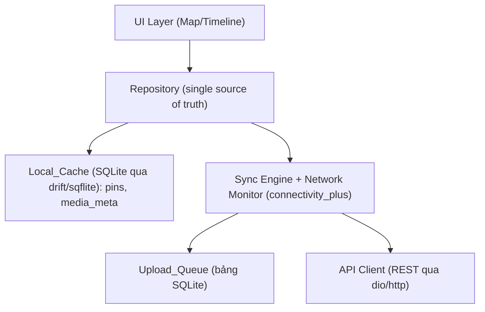

### Mô hình dữ liệu cục bộ

> Truy cập SQLite phía client qua **drift** (type-safe, reactive query) hoặc **sqflite**; dữ liệu key-value nhỏ (vd. cờ onboarding, ngôn ngữ) dùng **shared_preferences**. Schema SQL dưới đây là SQL chuẩn — với drift có thể khai báo tương ứng qua bảng Dart hoặc câu lệnh `CREATE TABLE` trong migration.

```sql
-- SQLite phía client (truy cập qua drift/sqflite)
CREATE TABLE local_pins (
  id TEXT PRIMARY KEY,          -- uuid sinh client (offline-friendly)
  map_id TEXT, title TEXT, note TEXT, memory_date TEXT,
  lat REAL, lng REAL,
  synced INTEGER DEFAULT 0,     -- 0 = chưa đồng bộ
  dirty INTEGER DEFAULT 0,      -- 1 = có thay đổi cục bộ chờ đẩy
  updated_at TEXT
);

CREATE TABLE upload_queue (
  id TEXT PRIMARY KEY,
  pin_id TEXT, type TEXT, local_uri TEXT, mime TEXT, size_bytes INTEGER,
  status TEXT DEFAULT 'pending', -- pending | uploading | failed | done
  attempts INTEGER DEFAULT 0,
  next_attempt_at TEXT
);
```

### Cơ chế retry

- **Trigger:** khi `connectivity_plus` báo có mạng, hoặc theo lịch nền (background task, vd. `workmanager`).
- **Chọn item:** mọi item `status IN ('pending','failed')` và `next_attempt_at <= now` (Req 9.4 — gồm cả chưa thử và đã thất bại).
- **Exponential backoff:** `delay = min(base * 2^attempts, maxDelay)` + jitter để tránh đồng loạt.
- **Idempotency:** dùng `id` (uuid client) làm idempotency key khi đồng bộ pin, tránh tạo trùng khi retry.
- **Hoàn tất:** upload thành công → `DELETE` item khỏi `upload_queue` (Req 9.5); pin set `synced=1, dirty=0`.

### Quy tắc hiển thị offline (Req 9.1)

Khi mất mạng, UI đọc thẳng từ `local_pins` (text + tọa độ). Media ảnh/audio chưa tải xuống hiển thị placeholder; phần text/tọa độ vẫn đầy đủ.

---

## Mô hình bảo mật & phân quyền (Security & Authorization)

### Xác thực (Authentication)

- **OAuth Apple/Google** là phương thức đăng nhập duy nhất (không mật khẩu) — Req 1.
- **JWT access token** (TTL ngắn ~15 phút) + **refresh token** (TTL dài, xoay vòng).
- **Thu hồi tức thì:** logout đưa `jti` vào Redis denylist tới khi token hết hạn tự nhiên → request kèm token thu hồi/hết hạn bị `401` (Req 1.4, 1.6).
- **Không tracking/quảng cáo:** không tích hợp SDK analytics quảng cáo; chỉ log kỹ thuật tối thiểu, không hồ sơ hành vi (Req 1.5).

### Phân quyền (Authorization)

Mọi truy cập Pin/Media đi qua một **authorization resolver** trả về quyền của `userId` với tài nguyên:

| Tài nguyên | Được phép khi |
|-----------|----------------|
| Pin thuộc Personal_Map | `userId` là Owner của map (Req 2.6, 2.7) |
| Pin thuộc Duo_Map | `userId` là Member của map (Req 5.3, 5.5) |
| Media của Pin | `userId` có quyền với Pin chứa media đó (Req 3.7, 10.1) |
| Pin qua Share_Link | token hợp lệ & chưa thu hồi → **chỉ** đúng Pin đó (Req 6.3, 6.4) |

- Sai quyền sửa/xóa → `403`; xem Personal_Map người khác → kết quả rỗng (Req 2.7); Duo_Map người ngoài → `403` (Req 5.5).
- **Gỡ Member / xóa tài khoản** → thu hồi quyền truy cập map ngay (Req 5.6, 10.4).

### Bảo mật truyền tải & lưu trữ

- **HTTPS/TLS** bắt buộc qua Nginx (Req 10.5).
- **Media:** chỉ truy cập qua **presigned GET URL có thời hạn**; object key không đoán được; bucket R2 private (không public-read).
- **Share_Link token:** ngẫu nhiên đủ entropy (≥128 bit), kiểm `revoked` mỗi truy cập.

### Xóa tài khoản nguyên tử + cleanup R2 (Req 10.2, 10.3)

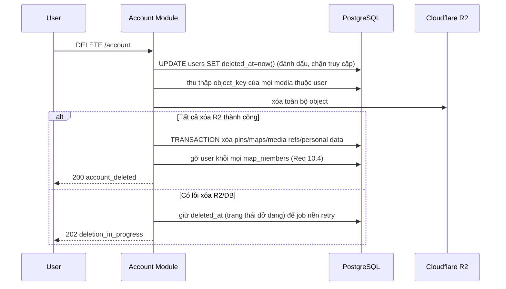

- Việc xóa **chỉ coi là thành công** khi cả R2 và DB đã sạch (Req 10.2). Lỗi giữa chừng → giữ trạng thái `deleted_at` và một **cleanup job** thử lại đến khi hoàn tất (Req 10.3). Trong lúc dở dang, tài khoản bị chặn đăng nhập/truy cập.
- **Xuất dữ liệu** (`/account/export`) chỉ trả dữ liệu của **chính** người yêu cầu (Req 10.6, 10.7).

---

## Correctness Properties (Thuộc tính đúng đắn)

*Một thuộc tính (property) là đặc tính hoặc hành vi phải đúng trên mọi lần thực thi hợp lệ của hệ thống — về bản chất là một phát biểu hình thức về điều mà hệ thống phải làm. Các thuộc tính đóng vai trò cầu nối giữa đặc tả ngôn ngữ tự nhiên và các bảo đảm đúng đắn có thể kiểm chứng bằng máy.*

Các thuộc tính dưới đây được rút ra từ phần prework phân tích từng acceptance criteria và đã qua bước **reflection** để loại bỏ trùng lặp (gộp các tiêu chí cùng bản chất thành một thuộc tính tổng quát). Mỗi thuộc tính áp dụng cho phần **logic nghiệp vụ thuần** của Backend_Service/Mobile_Client và sẽ được kiểm thử bằng property-based testing với generator ngẫu nhiên (tối thiểu 100 vòng).

### Property 1: Validate tọa độ đúng biên

*Với mọi* cặp tọa độ `(lat, lng)`, thao tác tạo/sửa Pin SHALL được chấp nhận khi và chỉ khi `lat ∈ [-90, 90]` và `lng ∈ [-180, 180]`; mọi giá trị ngoài khoảng SHALL bị từ chối với lỗi validate.

**Validates: Requirements 2.3**

### Property 2: Round-trip tạo & đọc Pin

*Với mọi* Pin hợp lệ được tạo trên một map mà người dùng có quyền, đọc lại Pin đó SHALL trả về cùng `title/note/memoryDate/lat/lng`, và cột `geom` SHALL nhất quán với `(lat, lng)`. Sau khi cập nhật, đọc lại SHALL phản ánh giá trị mới và `updated_at >= created_at`.

**Validates: Requirements 2.1, 2.4**

### Property 3: Xóa Pin xóa kèm toàn bộ Media

*Với mọi* Pin có tập Media tùy ý (kích thước/loại bất kỳ), sau khi xóa Pin SHALL không còn bất kỳ tham chiếu Media nào của Pin đó trong cơ sở dữ liệu, và mọi `object_key` tương ứng SHALL được yêu cầu xóa trên Object_Storage.

**Validates: Requirements 2.5**

### Property 4: Phân quyền nhất quán, không rò rỉ dữ liệu giữa người dùng

*Với mọi* cấu hình người dùng, bản đồ (Personal/Duo), thành viên, Pin và Share_Link, một yêu cầu truy cập/sửa/xóa Pin hoặc Media SHALL được cấp **khi và chỉ khi** người gọi có quyền hợp lệ (Owner của Personal_Map, Member của Duo_Map, hoặc người giữ Share_Link hợp lệ với đúng phạm vi 1 Pin). Người không có quyền sửa/xóa SHALL nhận `403`; truy vấn Pin của Personal_Map không sở hữu SHALL trả kết quả rỗng; và không có truy cập nào làm lộ Pin/Media của người dùng khác.

**Validates: Requirements 2.6, 2.7, 3.7, 5.3, 5.5, 10.1**

### Property 5: Bất biến thành viên Duo_Map (đúng tối đa 2)

*Với mọi* chuỗi thao tác tạo Duo_Map và tham gia (join), số Member của một Duo_Map SHALL không bao giờ vượt quá 2; Duo_Map mới tạo SHALL có đúng Owner là người tạo (role `owner`); và một yêu cầu tham gia SHALL chỉ thành công khi đồng thời người dùng đã xác thực và Invitation hợp lệ — yêu cầu tham gia vào Duo_Map đã đủ 2 Member SHALL bị từ chối ("đầy").

**Validates: Requirements 4.1, 4.4, 4.5, 5.1**

### Property 6: Bất biến một Invitation pending & vô hiệu hóa sau dùng/thu hồi/hết hạn

*Với mọi* Duo_Map, tại mọi thời điểm SHALL tồn tại tối đa một Invitation ở trạng thái `pending`; và *với mọi* Invitation, sau khi nó đã được chấp nhận, bị thu hồi, hoặc hết hạn, mọi lần dùng lại (accept) tiếp theo với cùng mã SHALL bị từ chối.

**Validates: Requirements 4.2, 4.3, 4.6, 4.7, 5.2**

### Property 7: Round-trip & cách ly Share_Link

*Với mọi* Pin, tạo một Share_Link rồi resolve token đó SHALL trả về đúng nội dung và tọa độ (`lat`, `lng`) của **đúng Pin** đó và không có Pin/bản đồ nào khác; sau khi Share_Link bị thu hồi, mọi lần resolve tiếp theo SHALL bị từ chối.

**Validates: Requirements 6.1, 6.2, 6.3, 6.4**

### Property 8: Tính đúng & đủ của truy vấn Bounding_Box

*Với mọi* tập Pin và mọi Bounding_Box, kết quả truy vấn Map_View SHALL bằng đúng tập các Pin có tọa độ nằm trong Bounding_Box đó — không trả Pin ngoài khung nhìn (soundness) và không bỏ sót Pin trong khung nhìn (completeness).

**Validates: Requirements 7.1, 7.2**

### Property 9: Nhất quán cache với nguồn dữ liệu sau invalidation

*Với mọi* chuỗi thao tác xen kẽ (tạo/sửa/xóa Pin và truy vấn Bounding_Box), kết quả trả về từ lớp có cache SHALL luôn bằng kết quả truy vấn trực tiếp nguồn dữ liệu (PostGIS) tại cùng thời điểm — nghĩa là sau mỗi thay đổi Pin, dữ liệu đệm liên quan được làm mới sao cho không bao giờ phục vụ dữ liệu cũ.

**Validates: Requirements 7.5**

### Property 10: Sắp xếp Timeline đơn điệu và bảo toàn tập Pin

*Với mọi* tập Pin và thứ tự (`asc`/`desc`) do người dùng chọn, kết quả Timeline_View SHALL là một hoán vị đầy đủ của tập Pin đầu vào (không mất, không thêm Pin) và được sắp đơn điệu theo `memoryDate`; các Pin thiếu `memoryDate` SHALL được giữ lại (đẩy về cuối) thay vì bị loại bỏ.

**Validates: Requirements 8.1, 8.2, 8.3**

### Property 11: Hội tụ đồng bộ offline (Upload_Queue)

*Với mọi* trạng thái offline ban đầu (tập Pin tạo/sửa cục bộ kèm Media), sau khi khôi phục mạng và đồng bộ thành công, hệ thống cục bộ SHALL hội tụ về trạng thái nhất quán: mọi Pin trở thành `synced` và Upload_Queue trở nên rỗng; một mục chỉ bị xóa khỏi Upload_Queue khi đã tải lên thành công, ngược lại vẫn còn trong hàng đợi.

**Validates: Requirements 9.2, 9.3, 9.5**

### Property 12: Tập mục được retry đúng

*Với mọi* trạng thái Upload_Queue (các mục `pending`/`failed`/`uploading`/`done` với số lần thử khác nhau), bộ chọn retry SHALL trả về đúng tập các mục cần thử lại = mọi mục ở trạng thái `pending` hoặc `failed` có `next_attempt_at <= now` — bao gồm cả mục chưa từng thử và mục đã thất bại trước đó.

**Validates: Requirements 9.4**

### Property 13: Xóa tài khoản nguyên tử (all-or-nothing) và sạch dữ liệu

*Với mọi* tài khoản người dùng có dữ liệu tùy ý: nếu thao tác xóa được báo **thành công** thì SHALL không còn bất kỳ Pin/Personal_Map/tham chiếu Media nào của người dùng trong cơ sở dữ liệu, mọi `object_key` đã được yêu cầu xóa trên Object_Storage, và mọi tư cách Member trong Duo_Map đã bị gỡ; ngược lại, nếu **bất kỳ** thao tác xóa nào thất bại thì thao tác SHALL **không** được báo thành công và dữ liệu SHALL được giữ đủ để thử lại cho đến khi hoàn tất.

**Validates: Requirements 10.2, 10.3, 10.4**

### Property 14: Xác thực token — hết hạn hoặc bị thu hồi đều bị từ chối

*Với mọi* Access_Token, quá trình xác thực SHALL chấp nhận token khi và chỉ khi chữ ký hợp lệ, chưa hết hạn (`exp > now`) và `jti` không nằm trong danh sách thu hồi; token hết hạn hoặc đã bị thu hồi (sau logout) SHALL bị từ chối với `401`.

**Validates: Requirements 1.4, 1.6**

### Property 15: Upsert tài khoản OAuth idempotent

*Với mọi* hồ sơ OAuth `(provider, providerUserId)`, việc upsert nhiều lần liên tiếp SHALL luôn trả về cùng một tài khoản người dùng và SHALL không tạo ra bản ghi người dùng trùng lặp.

**Validates: Requirements 1.2**

### Property 16: Xuất dữ liệu đúng phạm vi người dùng

*Với mọi* người dùng, kết quả xuất dữ liệu SHALL chứa đúng tập Pin và tham chiếu Media thuộc về **chính** người dùng đó (đầy đủ, không thiếu) và SHALL không chứa Pin/Media của bất kỳ người dùng nào khác.

**Validates: Requirements 10.6, 10.7**

### Property 17: Nén ảnh client giảm kích thước trong ngưỡng & validate giới hạn

*Với mọi* ảnh đầu vào, sau khi nén/giảm độ phân giải phía client, độ phân giải kết quả SHALL không vượt quá độ phân giải tối đa cấu hình và số byte SHALL không lớn hơn ảnh gốc; và *với mọi* kích thước Media so với ngưỡng tối đa, thao tác upload SHALL bị từ chối (kèm thông báo giới hạn) khi và chỉ khi kích thước vượt ngưỡng — trong giới hạn thì không phát sinh thông báo giới hạn.

**Validates: Requirements 3.2, 3.5, 3.6**

### Property 18: DB chỉ lưu tham chiếu Media, không lưu nhị phân

*Với mọi* Media được đăng ký sau khi upload, bản ghi trong cơ sở dữ liệu SHALL chỉ chứa tham chiếu (`object_key` trỏ Object_Storage) cùng metadata (type/mime/size) và SHALL không chứa dữ liệu nhị phân của tệp.

**Validates: Requirements 3.3, 3.4**

> **Tiêu chí không lập thành property** (xử lý bằng EXAMPLE/INTEGRATION/SMOKE — xem Testing Strategy): 1.1, 1.3 (luồng/nhánh OAuth — integration/example), 1.5 (chính sách không tracking — smoke), 2.2, 3.1, 7.2 (render), 8.4, 9.1 (tương tác UI — example/component), 7.3, 7.4, 3.7 (sinh URL) (PostGIS/Redis/R2 — integration), 10.5 (TLS — smoke).

---

## Định hướng kiến trúc mở rộng (Phase 2–4)

Mục này chỉ nêu ở **mức kiến trúc** để các quyết định MVP không cản trở mở rộng; chi tiết sẽ đặc tả ở các vòng spec sau.

### Phase 2 — Group Map & Real-time (Req 11)

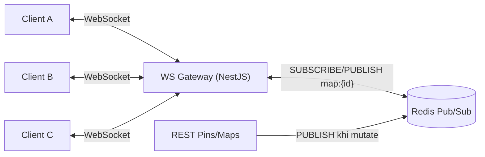

- **Real-time:** thêm **WebSocket Gateway** (NestJS) + **Redis Pub/Sub** kênh `map:{mapId}`. Khi một Member mutate Pin (qua REST), service publish sự kiện; mọi instance PM2 nhận và đẩy tới client đang subscribe. Đây là lý do Redis đã có mặt từ MVP (D5).
- **Group Map (3–10):** tổng quát hóa mô hình hiện tại — bỏ ràng buộc cứng "≤2", thay bằng `max_members` cấu hình theo loại map; `map_members` đã hỗ trợ nhiều member sẵn. Property 5 sẽ được tổng quát thành "≤ max_members".
- **Marker clustering:** gom cụm phía client trên dữ liệu bbox bằng **`flutter_map_marker_cluster`** (khi dùng `flutter_map`) hoặc thư viện **supercluster** cho Dart; backend có thể bổ sung endpoint trả cụm theo zoom nếu cần giảm payload.
- **Video 10–15s:** dùng lại pipeline media (presigned R2) + thêm validate độ dài video (10–15s) phía client và xác minh metadata phía backend.

### Phase 3 — AI Agents & nhắc nhớ (Req 12)

- **Tóm tắt hành trình:** dịch vụ AI tách rời nhận chuỗi Pin (text + metadata, **không** gửi nhị phân media), **ưu tiên Local LLM** để giữ riêng tư; kết quả tóm tắt lưu như một thực thể phái sinh.
- **"Ngày này năm xưa":** job định kỳ quét `memory_date` đạt mốc tròn năm → đẩy notification (khi người dùng bật và đang dùng app).
- **Đính kèm nhạc:** mở rộng `media_files.type` thêm `music`.

### Phase 4 — Monetization (Req 13)

- **Print-on-demand:** dịch vụ render Photobook/Poster từ dữ liệu Pin → tích hợp nhà in qua API; tách thành module/worker riêng.
- **Freemium:** thêm bảng `subscriptions` + hạn mức dung lượng theo gói (kiểm tra ở Media Module trước khi cấp upload URL); mở khóa Theme/Icon ở client theo entitlement.

> Tất cả các mở rộng trên **tái sử dụng** nền tảng MVP: R2 cho media, PostGIS cho không gian, Redis cho cache/Pub/Sub, NestJS module hóa. Không yêu cầu thay đổi mô hình dữ liệu lõi (chỉ bổ sung bảng/cột).

---

## Cấu trúc Project đề xuất

### Backend (NestJS — `apps/api`)

```
apps/api/
├─ src/
│  ├─ main.ts                      # bootstrap, helmet, TLS qua Nginx phía trước
│  ├─ app.module.ts
│  ├─ common/                      # guards, interceptors, filters, errors
│  │  ├─ auth.guard.ts             # JWT verify + denylist check
│  │  ├─ http-exception.filter.ts  # ánh xạ lỗi -> mã/định dạng chuẩn
│  │  └─ authorization.ts          # resolver quyền (pure, property-test)
│  ├─ modules/
│  │  ├─ auth/                     # OAuth, token (Req 1)
│  │  ├─ pins/                     # CRUD pin, validate tọa độ (Req 2)
│  │  │  ├─ pins.controller.ts
│  │  │  ├─ pins.service.ts
│  │  │  └─ coordinates.ts         # pure: validateCoordinates() (Property 1)
│  │  ├─ maps/                     # bbox + timeline + cache (Req 7,8)
│  │  │  ├─ bbox.ts                # pure: filterByBbox() (Property 8)
│  │  │  ├─ timeline.ts            # pure: sortTimeline() (Property 10)
│  │  │  └─ cache.service.ts       # Redis tiling + invalidation (Property 9)
│  │  ├─ media/                    # presigned R2 (Req 3)
│  │  ├─ sharing/                  # duo invite/join + share link (Req 4,5,6)
│  │  │  ├─ invitation.ts          # pure: vòng đời invitation (Property 6)
│  │  │  ├─ membership.ts          # pure: bất biến member (Property 5)
│  │  │  └─ share-link.ts          # pure: resolve/revoke (Property 7)
│  │  └─ account/                  # export + delete nguyên tử (Req 10)
│  ├─ infra/
│  │  ├─ prisma/                   # schema.prisma + client
│  │  ├─ redis/                    # redis client + keys
│  │  └─ r2/                       # S3 client cho R2 + signer (interface mock được)
│  └─ domain/                      # types/entities dùng chung
├─ test/
│  ├─ unit/                        # ví dụ + edge case
│  ├─ property/                    # fast-check (Property 1..10, 13..16, 18 — phía backend)
│  └─ integration/                 # PostGIS, Redis, R2 (testcontainers)
├─ prisma/migrations/
├─ Dockerfile
├─ ecosystem.config.js             # cấu hình PM2 cluster
└─ docker-compose.yml              # api + postgres(postgis) + redis
```

### Mobile (Flutter — `apps/mobile`)

```
apps/mobile/
├─ lib/
│  ├─ main.dart                    # bootstrap app, khởi tạo DI, router, l10n
│  ├─ app/                         # điều hướng (go_router) + screens (Widget)
│  │  ├─ router.dart               # cấu hình go_router (routes, deep link /p/:token)
│  │  ├─ map_screen.dart           # Map_View (flutter_map/mapbox_maps_flutter, render theo bbox)
│  │  ├─ timeline_screen.dart      # Timeline_View
│  │  ├─ pin_editor_screen.dart    # nhập title/note/date + đính kèm media
│  │  └─ pin_detail_screen.dart    # xem chi tiết kỷ niệm (BottomSheet)
│  ├─ data/
│  │  ├─ db/                       # drift database (local_pins, upload_queue)
│  │  │  ├─ app_database.dart      # khai báo bảng drift + migration
│  │  │  └─ daos.dart              # DAO cho local_pins / upload_queue
│  │  ├─ repository.dart           # single source of truth (offline-first)
│  │  └─ api_client.dart           # REST client (dio/http)
│  ├─ sync/
│  │  ├─ sync_engine.dart          # đồng bộ khi có mạng (Property 11)
│  │  ├─ retry_selector.dart       # pure Dart: chọn item retry (Property 12)
│  │  └─ network_monitor.dart      # connectivity_plus
│  ├─ media/
│  │  └─ image_compressor.dart     # nén ảnh client (flutter_image_compress) + logic ngưỡng (Property 17)
│  ├─ auth/                        # OAuth flow (google_sign_in / sign_in_with_apple)
│  └─ l10n/                        # ARB files (intl + flutter_localizations), mặc định vi
├─ test/
│  ├─ unit/                        # ví dụ + edge case (flutter test)
│  └─ property/                    # glados (Property 11, 12, 17 phía client)
├─ pubspec.yaml                    # dependencies: flutter_map/mapbox_maps_flutter, drift, sqflite,
│                                  #   shared_preferences, connectivity_plus, workmanager,
│                                  #   flutter_image_compress, record (hoặc flutter_sound),
│                                  #   image_picker, dio, go_router, flutter_riverpod (hoặc flutter_bloc),
│                                  #   intl, flutter_localizations, glados (dev)
└─ analysis_options.yaml           # lint rules (flutter_lints)
```

- **State management & navigation:** dùng **Riverpod** (hoặc **Bloc**) cho quản lý state và **go_router** cho điều hướng/deep link. Repository pattern giữ vai trò **single source of truth** offline-first.
- **Background retry:** lập lịch chạy nền bằng **`workmanager`** (Android) / **BGTaskScheduler** (iOS) hoặc periodic timer khi app foreground; trigger thêm khi `connectivity_plus` báo có mạng.
- **Các pure Dart function để property-test bằng `glados`:**
  - `retry_selector.dart` — bộ chọn item cần retry (**Property 12**).
  - `image_compressor.dart` — logic xác định độ phân giải/ngưỡng kích thước sau nén (**Property 17**), tách phần thuần khỏi lời gọi `flutter_image_compress`.
  - logic hội tụ đồng bộ trong `sync_engine.dart` — mô hình hóa trạng thái offline/queue thuần để kiểm thử (**Property 11**).

> **Chia sẻ logic giữa backend (TS) và mobile (Dart):** Vì mobile dùng Dart còn backend dùng TypeScript, **không** thể dùng chung pure functions JS như mô hình monorepo TS trước đây. Pure logic phía client (validate ngưỡng nén, chọn retry, hội tụ đồng bộ) được **viết lại bằng Dart** và **property-test độc lập bằng `glados`**. Chỉ chia sẻ **TYPE/contract** (DTO, mã lỗi, hình dạng request/response) giữa hai phía qua **OpenAPI + codegen** (sinh model Dart từ đặc tả OpenAPI của backend) để giữ nhất quán hợp đồng API.

---

## Xử lý lỗi (Error Handling)

### Định dạng lỗi chuẩn

Mọi lỗi trả về dạng JSON nhất quán, ánh xạ qua một `HttpExceptionFilter` toàn cục:

```json
{
  "error": "validation_error",
  "message": "Kinh độ phải nằm trong khoảng [-180, 180].",
  "details": { "field": "lng", "value": 200.5 },
  "requestId": "req_01H..."
}
```

### Bảng ánh xạ lỗi

| Tình huống | Mã | `error` | Yêu cầu |
|-----------|-----|---------|---------|
| Token thiếu/sai/hết hạn/thu hồi | 401 | `unauthorized` | 1.4, 1.6 |
| OAuth thất bại/hủy | 401 | `oauth_failed` | 1.3 |
| Không có quyền sửa/xóa tài nguyên | 403 | `forbidden` | 2.6, 5.5 |
| Tọa độ ngoài khoảng / input sai | 422 | `validation_error` | 2.3 |
| Media vượt giới hạn kích thước | 413 | `payload_too_large` | 3.5 |
| Đã có Invitation pending | 409 | `invitation_pending_exists` | 4.3 |
| Duo_Map đã đủ 2 member | 409 | `map_full` | 4.5 |
| Invitation hết hạn/đã dùng/thu hồi | 410 | `invalid_invitation` | 5.2 |
| Share_Link bị thu hồi | 410 | `link_revoked` | 6.4 |
| Tài nguyên không tồn tại | 404 | `not_found` | — |
| Lỗi nội bộ | 500 | `internal_error` | — |

### Nguyên tắc xử lý lỗi theo tầng

- **Validate sớm:** dữ liệu vào (tọa độ, kích thước, enum loại media) được validate ở DTO/pure function trước khi chạm DB (Property 1, 17).
- **Giao dịch (transaction):** join Duo_Map, accept Invitation, xóa Pin (kèm media), xóa tài khoản chạy trong transaction PostgreSQL với `SELECT ... FOR UPDATE` để tránh race (vd. hai người accept cùng lúc làm vượt 2 member) — bảo đảm Property 5, 6.
- **Bù trừ thao tác ngoài DB (R2):** xóa Pin/tài khoản xóa object R2 **trước** khi commit xóa reference, hoặc đánh dấu trạng thái dở dang để cleanup job thử lại nếu R2 lỗi (Property 3, 13).
- **Idempotency:** mutate có khả năng retry (đồng bộ offline) dùng `id` client làm idempotency key để retry không tạo trùng (Property 11).
- **Cache fail-open:** lỗi Redis không làm hỏng nghiệp vụ — truy vấn rơi về PostGIS trực tiếp; cache chỉ là tối ưu (Property 9 vẫn đúng vì nguồn sự thật là PostGIS).
- **Lỗi client/offline:** thao tác offline luôn ghi Local_Cache + Upload_Queue, không bao giờ mất dữ liệu người dùng; lỗi upload → giữ trong queue, tăng `attempts`, backoff (Property 11, 12).

---

## Chiến lược kiểm thử (Testing Strategy)

Áp dụng **tiếp cận kép**: unit/example test cho hành vi cụ thể & edge case, **property-based test** cho các thuộc tính tổng quát, và integration/smoke test cho hạ tầng.

### Property-Based Testing (PBT)

- **Thư viện:**
  - **Backend (TypeScript):** **fast-check** chạy với Jest. **Không** tự cài đặt PBT từ đầu.
  - **Mobile (Dart):** **`glados`** chạy với `flutter test`. **Không** tự cài đặt PBT từ đầu.
  - Các property phía client — **Property 11** (hội tụ đồng bộ offline), **Property 12** (bộ chọn retry), **Property 17** (nén ảnh & giới hạn) — được kiểm thử bằng **`glados`** trong Dart. Các property còn lại (logic backend) kiểm thử bằng **fast-check**.
- **Cấu hình:** mỗi property test chạy **tối thiểu 100 vòng** — fast-check: `fc.assert(..., { numRuns: 100 })`; glados: cấu hình `Glados(..., explore: ExploreConfig(numRuns: 100))` (hoặc tương đương).
- **Gắn nhãn:** mỗi test PBT chú thích tham chiếu property của tài liệu thiết kế theo định dạng (giữ nguyên cho cả hai phía):
  `// Feature: ban-do-ky-niem, Property {number}: {property_text}`
- **Đối tượng test:**
  - Backend — các **pure function** đã tách (`coordinates.ts`, `bbox.ts`, `timeline.ts`, `invitation.ts`, `membership.ts`, `share-link.ts`, `authorization.ts`) và các service dùng **in-memory/mock** cho PG/Redis/R2 để chạy nhanh, rẻ.
  - Mobile — các **pure Dart function** đã tách (`retry_selector.dart`, phần thuần của `image_compressor.dart`, mô hình hội tụ trong `sync_engine.dart`).
- **Generator chú ý edge case:** tọa độ biên (±90, ±180, ngoài khoảng), chuỗi whitespace/unicode cho title/note, `memoryDate` null (Timeline), tập media rỗng/nhiều phần tử, điểm lỗi ngẫu nhiên cho xóa tài khoản.

**Ánh xạ Property → loại test:**

| Property | Đối tượng | Kỹ thuật |
|----------|-----------|----------|
| 1 Validate tọa độ | `validateCoordinates` | PBT thuần |
| 2 Round-trip Pin | `PinsService` + repo in-memory | PBT |
| 3 Xóa Pin → xóa Media | `PinsService` + R2 mock | PBT |
| 4 Phân quyền không rò rỉ | `authorization` resolver | PBT (sinh đồ thị quyền) |
| 5 Member Duo ≤2 | `membership` | PBT (chuỗi thao tác join) |
| 6 Vòng đời Invitation | `invitation` | PBT (state machine) |
| 7 Share_Link round-trip/cách ly | `share-link` | PBT |
| 8 Bounding-box đúng & đủ | `filterByBbox` | PBT |
| 9 Nhất quán cache | `cache.service` + nguồn giả lập | PBT model-based |
| 10 Timeline sort | `sortTimeline` | PBT |
| 11 Hội tụ đồng bộ offline | `sync_engine.dart` + backend mock (Dart) | PBT model-based (glados) |
| 12 Chọn retry | `retry_selector.dart` (pure Dart) | PBT thuần (glados) |
| 13 Xóa tài khoản nguyên tử | `AccountService` + PG/R2 mock | PBT (sinh điểm lỗi) |
| 14 Xác thực token | token verifier | PBT |
| 15 Upsert OAuth idempotent | `AuthService` upsert + repo in-memory | PBT |
| 16 Export đúng phạm vi | `AccountService.export` | PBT |
| 17 Nén ảnh & giới hạn | `image_compressor.dart` (pure Dart, mock pipeline) | PBT (glados) |
| 18 DB chỉ lưu tham chiếu | `MediaService.register` | PBT + kiểm schema |

### Integration Test

- **PostGIS spatial (Req 7.3):** dùng **Testcontainers** (Postgres + PostGIS) — insert tập Pin, chạy truy vấn `ST_MakeEnvelope(...) && geom`, đối chiếu với kết quả lọc thuần trong bộ nhớ (so khớp Property 8 trên DB thật); xác minh chỉ mục **GiST** được sử dụng (`EXPLAIN`).
- **Redis cache (Req 7.4):** map active → lần truy vấn thứ 2 phục vụ từ cache (cache hit), kiểm tra key tile tồn tại; sau mutate → key liên quan bị xóa (đối chiếu Property 9 end-to-end).
- **R2/presigned (Req 3.3, 3.7):** dùng MinIO (S3-compatible) hoặc R2 sandbox — upload qua presigned PUT rồi đọc qua presigned GET; xác minh DB chỉ lưu `object_key`.
- **OAuth (Req 1.1–1.3):** mock provider (apple/google) — kiểm authorizationUrl đúng, callback thành công cấp token, callback lỗi/hủy → 401 không token (1-3 ví dụ).
- **Offline/retry (Req 9):** mô phỏng mất mạng (mock `connectivity_plus`) → tạo Pin offline → khôi phục mạng → xác minh đồng bộ + queue rỗng (đối chiếu Property 11 end-to-end với backend test).

### Unit / Example Test

- Form Pin nhập đủ title/note/memoryDate (Req 2.2); enum media gồm image/audio/text (Req 3.1); render chỉ marker trong viewport (Req 7.2); chọn Pin Timeline mở chi tiết + vị trí (Req 8.4); offline hiển thị text/tọa độ từ cache (Req 9.1).

### Smoke / Static Check

- Không có dependency quảng cáo/tracking trong manifest; không có SDK analytics hành vi (Req 1.5).
- Schema không có cột nhị phân (bytea/blob) cho media; không ghi file media trên đĩa server (Req 3.4).
- Cấu hình Nginx ép HTTPS/TLS, redirect HTTP→HTTPS, bật HSTS (Req 10.5).

### Cân bằng số lượng test

Ưu tiên property test cho phần phủ không gian input lớn (tọa độ, bbox, phân quyền, vòng đời invitation, sắp xếp, đồng bộ). Hạn chế viết quá nhiều unit test trùng phạm vi đã được property test bao phủ; unit test tập trung vào ví dụ minh họa, điểm tích hợp giữa thành phần, và edge case khó diễn đạt dưới dạng property.
