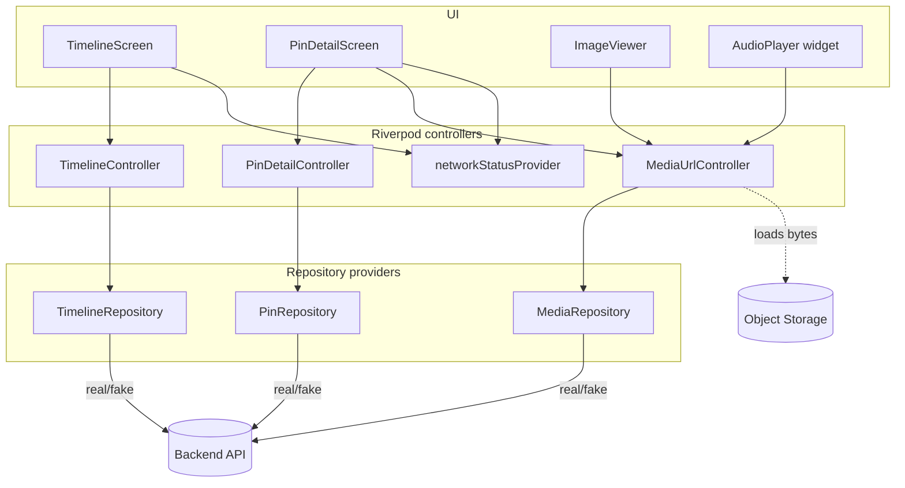
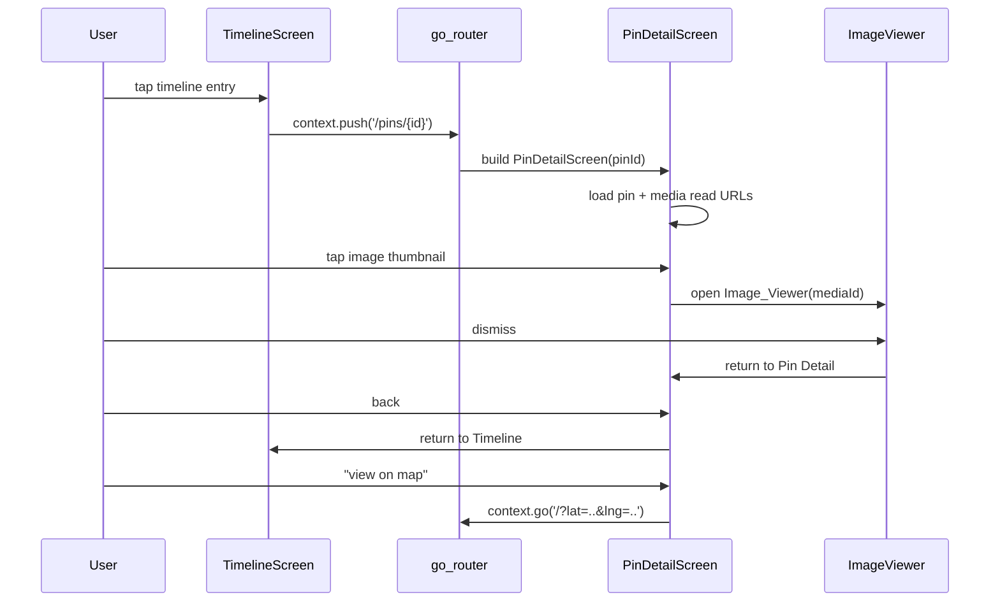

# Design Document

## Overview

This feature completes the post-map browsing flow in the Memo Flutter app (`apps/mobile`):
a chronological **Timeline**, a rich **Pin Detail** view, and a **Media Viewer** for image and
audio media. The backend (`apps/api`) already exposes every endpoint this work needs, so the
scope is strictly the mobile client. The implementation replaces the design-time mock markup
in `timeline_screen.dart` and `pin_detail_screen.dart` with real, repository-driven UI and adds
the media viewing components under `apps/mobile/lib/media`.

The design follows the repository's mandatory data-flow rule (`ApiClient -> Repository ->
Provider -> UI`). The UI layer depends only on Riverpod providers and never calls Dio, HTTP, or
backend endpoint paths directly. Media binaries are never proxied through the backend or stored
in the database: the backend signs a short-lived **Authorized Read URL** over an object key, and
the mobile client loads bytes from object storage using that URL. Text and coordinate content
must remain visible in offline mode while media degrades to placeholders, and all new
user-facing strings must be localizable in English and Vietnamese.

### Goals

- Render the Timeline from `TimelineRepository`, with a newest/oldest sort toggle.
- Keep pins without a `memoryDate` visible and ordered last for both sort directions.
- Navigate Timeline -> Pin Detail -> Media Viewer using the existing `go_router` routes.
- Display pin title, note, memory date, and coordinates from the `PinDto`.
- Load image and audio media through Authorized Read URLs obtained from `MediaRepository`.
- Degrade gracefully to placeholders when media is offline, pending, uncached, or failing.
- Work end-to-end against fake repositories when `USE_MOCK_DATA=true`.
- Localize every new string (en + vi).

### Non-Goals

- No backend changes. The API contract for timeline, pins, and media is already defined.
- No pin editing, deletion, or sharing implementation; this feature only exposes the action
  entry points (edit navigates to the existing editor route; delete/share open their entry
  points as defined by the requirements).
- No video media (the contract defines `image`, `text`, and `audio` only).
- No timeline pagination UI beyond the first page; the repository already returns a cursor that
  a later slice can consume.

### Key Design Decisions

| Decision | Rationale |
| --- | --- |
| Add a `MediaRepository.createReadUrl(mediaId)` method backed by `GET /api/v1/media/:mediaId/presign` | Requirement 7 needs an Authorized Read URL operation; the current interface only has upload/register methods. This keeps URL construction out of the UI. |
| Introduce Riverpod `AsyncNotifier` controllers (`TimelineController`, `PinDetailController`) instead of ad-hoc `setState` loading flags | Centralizes loading/error/data state, makes sorting deterministic and testable, and removes Dio-agnostic mock markup from the widgets. |
| Sort the Timeline client-side from the loaded page rather than re-fetching on every toggle | Requirement 2.5/2.8 require the *same* set of pins reordered; sorting in-memory guarantees no pin is added or dropped on toggle and avoids a network round-trip. The repository `order` param is still sent so the first fetch and any refresh match the selected order. |
| Model media load state per media item (`MediaLoadState`) | Requirements 8, 9, and 10 require independent loading, placeholder, and retry behavior for each media item. |
| Resolve offline state through a `NetworkStatus` provider wrapping `connectivity_plus` | Requirement 10 needs an explicit Offline_Mode signal; `network_monitor.dart` is currently an empty stub to be fleshed out. |
| Generate localized strings via the existing `flutter gen-l10n` pipeline (`app_en.arb`, `app_vi.arb`) | The l10n delegate and `l10n.yaml` already exist; adding keys is the conventional path. |

## Architecture

### Layered data flow

The feature respects the project-owned port/adapter and repository boundaries from
`AGENTS.md`:

```
UI (Timeline / Pin Detail / Media Viewer widgets)
        |  watches providers only
        v
Riverpod controllers (TimelineController, PinDetailController, MediaUrlController)
        |  depend on repository providers
        v
Repository interfaces (TimelineRepository, PinRepository, MediaRepository)
        |        \
   ApiXxxRepository   FakeXxxRepository   (selected by USE_MOCK_DATA)
        |
   ApiClient (Dio) -> Backend  /  object storage (read URL only)
```

The UI never imports `ApiClient`, Dio, or endpoint strings. Media bytes load from the object
storage URL via Flutter's `Image.network` / audio player against the Authorized Read URL, which
is the one allowed direct-to-storage path (already authorized by the backend, mirroring the
upload-client pattern described in `contract/mobile-data-layer-usage.md`).

### Component diagram



### Navigation flow

Routes already exist in `router.dart` (`/timeline`, `/pins/:pinId`, `/pins/:pinId/edit`, `/`).
The feature wires the screens to them:



### State management

Each screen is driven by an `AsyncNotifier` that exposes a sealed/immutable state object. The
widget watches the provider and renders loading, error, empty, or data branches. This removes
the current `_isLoading`/`setState` and hard-coded mock fallbacks from the skeleton widgets.

## Components and Interfaces

### 1. MediaRepository (extended)

Requirement 7 needs an Authorized Read URL operation. Extend the existing interface in
`apps/mobile/lib/data/repositories/media_repository.dart`:

```dart
abstract interface class MediaRepository {
  Future<PresignResponseDto> createPresignedUpload({ ... });   // existing
  Future<PinMediaDto> registerMedia({ ... });                  // existing

  /// Returns a short-lived Authorized Read URL for a media item.
  /// Backed by GET /api/v1/media/:mediaId/presign.
  Future<MediaReadUrlDto> createReadUrl(String mediaId);       // new
}
```

`ApiMediaRepository.createReadUrl` calls `apiClient.get('/media/$mediaId/presign', decoder:
MediaReadUrlDto.fromJson)`. `FakeMediaRepository.createReadUrl` returns a deterministic
local URL plus an expiry so mock mode behaves like the real flow (Requirement 11.3/11.4).

### 2. TimelineController

A Riverpod `AutoDisposeAsyncNotifier` that owns timeline loading, the active sort order, and the
ordered projection of pins.

```dart
class TimelineState {
  final List<PinDto> orderedPins;   // already sorted for the active order
  final TimelineSortOrder order;    // newest | oldest
}

enum TimelineSortOrder { newest, oldest } // newest -> 'desc', oldest -> 'asc'

final timelineControllerProvider =
    AutoDisposeAsyncNotifierProvider<TimelineController, TimelineState>(...);
```

Responsibilities:
- On first build: resolve the active map via `mapRepositoryProvider.getDefaultMap()`, then load
  the timeline with `order = 'desc'` (newest) (Req 2.2).
- Expose `setOrder(TimelineSortOrder)` which reorders the already-loaded pins in memory and
  updates state (Req 2.3-2.8). The same pin set is retained (Req 2.5, 3.4).
- Sorting uses a single comparator (see `orderPins` below) so missing-date handling is identical
  across both directions (Req 3).
- Surfaces loading and error/retry to the screen (Req 1.2, 1.7).

### 3. Timeline ordering function (pure)

A standalone, testable pure function (e.g. in `apps/mobile/lib/app/timeline_ordering.dart`):

```dart
List<PinDto> orderPins(List<PinDto> pins, TimelineSortOrder order) {
  // 1. Partition: pins WITH memoryDate vs pins WITHOUT.
  // 2. Sort dated pins by memoryDate (desc for newest, asc for oldest),
  //    using id as a stable tie-breaker to match the backend contract.
  // 3. Append undated pins after all dated pins, in a stable order.
}
```

This mirrors the backend's documented ordering (`memoryDate` then `id`; undated last for both
directions) so the client projection is consistent with server pagination.

### 4. TimelineScreen (rewritten)

- Watches `timelineControllerProvider`.
- Renders: loading indicator (Req 1.2), one entry per pin (Req 1.3) showing title (Req 1.5) and
  memory-date label (Req 1.4) or the localized "date unknown" label (Req 3.3), empty-state
  message when zero items (Req 1.6), and an error message + retry control on failure (Req 1.7).
- Sort toggle (newest/oldest) bound to `setOrder` (Req 2.1).
- Tapping an entry calls `context.push('/pins/{id}')` (Req 4.1).
- All labels come from `AppLocalizations` (Req 12.1).
- Removes the hard-coded `itemCount: _items.isEmpty ? 5` mock fallback and the static
  Unsplash/`NetworkImage` placeholders.

### 5. PinDetailController

An `AutoDisposeAsyncNotifierProvider.family` keyed by `pinId`:

```dart
final pinDetailControllerProvider = AutoDisposeAsyncNotifierProvider
    .family<PinDetailController, PinDto, String>(...);
```

- Loads the pin via `pinRepositoryProvider.getPin(pinId)` (Req 4.2).
- Exposes the loaded `PinDto` (Req 4.3, 5.7) or an error state (Req 4.4).

### 6. MediaUrlController

A `family` controller keyed by `mediaId` that owns per-item media load state and retry:

```dart
sealed class MediaLoadState {}
class MediaLoading extends MediaLoadState {}
class MediaReady extends MediaLoadState { final String url; }
class MediaUnavailable extends MediaLoadState {}  // offline, pending, failed

final mediaUrlControllerProvider = AutoDisposeAsyncNotifierProvider
    .family<MediaUrlController, MediaLoadState, String>(...);
```

- On request: if offline (per `networkStatusProvider`) -> `MediaUnavailable` (Req 10.2).
  Otherwise call `mediaRepositoryProvider.createReadUrl(mediaId)`; success -> `MediaReady(url)`
  (Req 7.1-7.3), failure -> `MediaUnavailable` so the view shows a placeholder (Req 7.4).
- `retry()` re-requests the read URL and re-attempts load (Req 8.5).
- When connectivity returns, the controller can re-resolve so a placeholder upgrades to loaded
  media (Req 10.5).

### 7. PinDetailScreen (rewritten)

- Watches `pinDetailControllerProvider(pinId)`.
- Displays title (Req 5.1), note when non-empty (Req 5.2), memory-date label or "date unknown"
  (Req 5.3-5.4), coordinates when valid or "coordinates unavailable" (Req 5.5-5.6).
- Renders a selectable thumbnail per image media item (Req 8.1) and an `AudioPlayer` per audio
  media item (Req 9.1), each backed by its own `mediaUrlControllerProvider(mediaId)`.
- Shows a `MediaPlaceholder` for any media that is offline/pending/uncached/failed (Req 10.2,
  10.3, 7.4).
- Keeps title/note/date/coordinates visible regardless of media state (Req 10.1).
- Action entry points: "view on map" -> `context.go('/?lat=..&lng=..')` (Req 6.1), edit ->
  `context.push('/pins/{id}/edit')` (Req 6.2), delete entry point (Req 6.3), share entry point
  (Req 6.4). Back returns to Timeline via the navigation stack (Req 6.5).
- All labels from `AppLocalizations` (Req 12.2).

### 8. ImageViewer (`apps/mobile/lib/media/image_viewer.dart`)

- Full-screen view opened when an image thumbnail is selected (Req 8.2).
- Watches `mediaUrlControllerProvider(mediaId)`: shows a loading indicator while the URL is being
  retrieved or the image is decoding (Req 8.3); on `MediaReady`, loads via `Image.network(url)`.
- On load failure: shows `MediaPlaceholder` + localized retry control (Req 8.4); retry calls the
  controller's `retry()` (Req 8.5).
- Dismiss returns to Pin Detail (Req 8.6).

### 9. AudioPlayer widget (`apps/mobile/lib/media/audio_player.dart`)

- Wraps audio playback behind a small project-owned controller so the UI does not couple directly
  to a vendor package (OCP/DIP). `record` is present for capture; playback will use a thin
  `AudioPlaybackPort` with an adapter, consistent with the map port/adapter pattern.
- Play control plays from the Authorized Read URL (Req 9.2); while playing shows a pause control
  (Req 9.3); pause pauses playback (Req 9.4).
- On load failure: hides play/pause controls and shows a `MediaPlaceholder` indicating audio is
  unavailable (Req 9.5).

### 10. MediaPlaceholder (`apps/mobile/lib/media/media_placeholder.dart`)

A shared widget rendering a localized stand-in for pending/uncached/offline/failed media
(Req 10.2, 10.3, 12.3), with an optional retry callback used by the Image_Viewer.

### 11. networkStatusProvider

A provider wrapping `connectivity_plus` (already a dependency) exposing a simple online/offline
signal, fleshing out the `network_monitor.dart` stub. Used by `MediaUrlController` and the views
to decide Offline_Mode behavior (Req 10).

### 12. Localization keys

New keys added to `app_en.arb` and `app_vi.arb` (Req 12.4), e.g.:
`timelineTitle`, `sortNewest`, `sortOldest`, `timelineEmpty`, `timelineError`, `retry`,
`dateUnknown`, `coordinatesUnavailable`, `note`, `coordinates`, `viewOnMap`, `edit`, `share`,
`delete`, `mediaUnavailable`, `audioUnavailable`, `pinLoadError`. Strings are read through
`AppLocalizations.of(context)`; the "date unknown" label falls back to the English string when
the localized value is missing (Req 3.3, 5.4).

## Data Models

The feature reuses existing DTOs unchanged: `PinDto`, `PinMediaDto`, `PinMediaType`, and
`TimelinePageDto` (in `apps/mobile/lib/data/models`). One new response DTO is added for the read
URL.

### MediaReadUrlDto (new)

Maps the `GET /api/v1/media/:mediaId/presign` response (`{ "url", "expiresAt" }`):

```dart
class MediaReadUrlDto {
  const MediaReadUrlDto({ required this.url, required this.expiresAt });

  factory MediaReadUrlDto.fromJson(Object? value) {
    final JsonMap json = asJsonMap(value, name: 'media read url');
    return MediaReadUrlDto(
      url: readString(json, 'url'),
      expiresAt: readDateTime(json, 'expiresAt'),
    );
  }

  final String url;
  final DateTime expiresAt;
}
```

Added to the `models.dart` barrel export.

### View-state models (new, in-memory only)

| Model | Fields | Purpose |
| --- | --- | --- |
| `TimelineSortOrder` | enum `newest`, `oldest` | Maps to `order=desc` / `order=asc`. |
| `TimelineState` | `orderedPins: List<PinDto>`, `order: TimelineSortOrder` | Drives `TimelineScreen`. |
| `MediaLoadState` | sealed: `MediaLoading` \| `MediaReady(url)` \| `MediaUnavailable` | Per-media-item load state. |

### Domain mapping reference

| Glossary term | Representation |
| --- | --- |
| Pin | `PinDto` |
| Memory_Date | `PinDto.memoryDate` (`DateTime?`) |
| Pin_Media | `PinMediaDto` (`mediaType`: image/text/audio) |
| Authorized_Read_URL | `MediaReadUrlDto.url` |
| Sort_Order | `TimelineSortOrder` |
| Active_Map | `mapRepositoryProvider.getDefaultMap()` |

## Correctness Properties

*A property is a characteristic or behavior that should hold true across all valid executions of
a system - essentially, a formal statement about what the system should do. Properties serve as
the bridge between human-readable specifications and machine-verifiable correctness guarantees.*

This feature is predominantly UI rendering and navigation, which is best covered by widget and
example-based tests. However, the **Timeline ordering logic** (`orderPins`) is a pure function
over a large input space (lists of pins with/without dates, in any order) with clear universal
properties, so it is a strong candidate for property-based testing. The properties below target
that logic plus the media load-state resolution, which is also pure.

### Property 1: Ordering preserves the pin set

*For any* list of pins and *any* sort order, `orderPins` returns a list containing exactly the
same pins (same multiset of ids) as the input - none added, none removed.

**Validates: Requirements 2.5, 3.1, 3.4**

### Property 2: Undated pins are placed after dated pins

*For any* list of pins and *any* sort order, in the output every pin that has a `memoryDate`
appears before every pin that has no `memoryDate`.

**Validates: Requirements 3.2**

### Property 3: Dated pins follow the selected direction

*For any* list of pins, the dated pins in the output are ordered by `memoryDate` descending when
the order is `newest` and ascending when the order is `oldest`.

**Validates: Requirements 2.6, 2.7**

### Property 4: Sort toggle is order-reversible over the same set

*For any* list of pins, ordering as `newest` and ordering as `oldest` yield the same set of
pins, and re-applying `newest` after `oldest` reproduces the original `newest` ordering
(reordering only, never adding or dropping a pin).

**Validates: Requirements 2.5, 2.8, 3.4**

### Property 5: Media load resolves to ready only with a non-empty URL

*For any* media id, when the network is offline the resolved `MediaLoadState` is
`MediaUnavailable`; when online and the repository returns a read URL the state is `MediaReady`
with that URL; and when the repository fails the state is `MediaUnavailable`.

**Validates: Requirements 7.3, 7.4, 10.2**

## Error Handling

| Scenario | Handling | Requirement |
| --- | --- | --- |
| Timeline request fails | Controller emits error state; screen shows localized error message + retry control that re-runs the load | 1.7 |
| Empty timeline | Controller returns empty list; screen shows localized empty-state message (not placeholder rows) | 1.6 |
| Pin detail load fails | Controller emits error; screen shows localized error message | 4.4 |
| Read URL request fails | `MediaUrlController` -> `MediaUnavailable`; item shows `MediaPlaceholder` | 7.4 |
| Image fails to load from URL | Image_Viewer shows `MediaPlaceholder` + localized retry; retry re-requests URL | 8.4, 8.5 |
| Audio fails to load from URL | Audio_Player hides play/pause, shows unavailable placeholder | 9.5 |
| Offline mode | Text/coordinates stay visible; each unloadable media shows placeholder; recovery reloads media | 10.1, 10.2, 10.5 |
| Missing coordinates | Show localized "coordinates unavailable" label | 5.6 |
| Missing memory date | Show localized "date unknown" label, English fallback | 3.3, 5.4 |
| Mock-mode failure | Requesting view shows localized error; no fallback to real repos | 11.5 |

All repository calls surface `ApiException` (from `api_envelope.dart`); controllers catch it and
map to user-facing localized messages rather than leaking error codes to the UI. The UI never
inspects Dio errors directly.

## Testing Strategy

### Dual approach

- **Property-based tests** cover the pure Timeline ordering logic and media load-state
  resolution (Properties 1-5). The repo already includes `glados` as a dev dependency for PBT in
  Dart.
- **Widget and unit tests** cover rendering, navigation, and placeholder behavior, which are not
  amenable to universal quantification.

### Property-based tests

- Use `glados` to generate random `List<PinDto>` with a mix of present/absent `memoryDate`,
  random titles, ids, and dates.
- Each property test runs a minimum of 100 generated cases.
- Tag each test with a comment referencing its design property, format:
  `// Feature: timeline-pin-detail-media-viewer, Property {n}: {property text}`.
- Map one property to exactly one property-based test:
  - Property 1 -> set-preservation test on `orderPins`.
  - Property 2 -> undated-after-dated test.
  - Property 3 -> direction (asc/desc) test on dated pins.
  - Property 4 -> toggle reversibility test.
  - Property 5 -> `MediaUrlController` resolution test with a fake `MediaRepository` and a
    fake network status (generate offline/online and success/failure cases).

### Widget and unit tests (mock repositories via `USE_MOCK_DATA` / `ProviderScope` overrides)

Required by Requirement 13:
- Timeline renders all pins returned by the repository, including undated pins (Req 13.1).
- Changing the sort order reorders the Timeline without removing any pin (Req 13.2).
- Selecting a Timeline entry navigates to Pin Detail for the matching pin id (Req 13.3).
- Pin Detail shows a `MediaPlaceholder` when a read URL cannot be retrieved or media fails to
  load (Req 13.4).
- Pin Detail shows title, note, and coordinates when media is unavailable (Req 13.5).

Additional example/edge tests:
- Empty timeline shows the localized empty-state (Req 1.6); failed timeline shows error + retry
  (Req 1.7).
- "Date unknown" and "coordinates unavailable" labels render for missing data (Req 3.3, 5.4,
  5.6).
- Audio player hides controls and shows unavailable placeholder on failure (Req 9.5).
- Localization smoke test: every new key resolves in both `en` and `vi` (Req 12.4).

### Verification commands

From `apps/mobile` (use the Flutter path fallback from `AGENTS.md` if Flutter is not on PATH):

```bash
flutter gen-l10n
flutter analyze
flutter test
```
